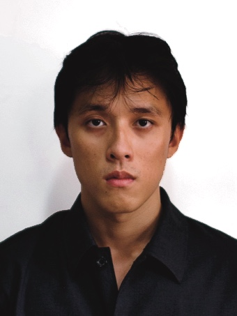
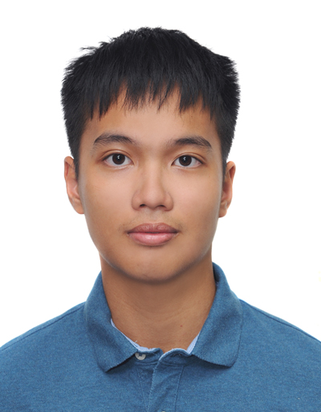

We are a team based in the [School of Computing, National University of Singapore](https://www.comp.nus.edu.sg).

You can reach us at the email `seer[at]comp.nus.edu.sg`

## Project team

### John Doe

[[homepage](http://www.comp.nus.edu.sg/~damithch)]
[[github](https://github.com/johndoe)]
[[portfolio](team/johndoe.md)]

* Role: Project Advisor

### Low En Xi

[[github](http://github.com/enxi-low)]
[[portfolio](team/johndoe.md)]

* Role: Developer
* Responsibilities: Storage

### Chan Wei Lun

[[github](http://github.com/wailon18)] [[portfolio](team/johndoe.md)]

* Role: Developer
* Responsibilities: Logic

### Tan Jun Hao

[[github](http://github.com/geekygooble)]
[[portfolio](team/johndoe.md)]

* Role: Developer
* Responsibilities: UI

### Jerome Goh Rih Yu

[[github](https://github.com/JeromeGohRY)]
[[portfolio](team/johndoe.md)]

* Role: Developer
* Responsibilities: Model
