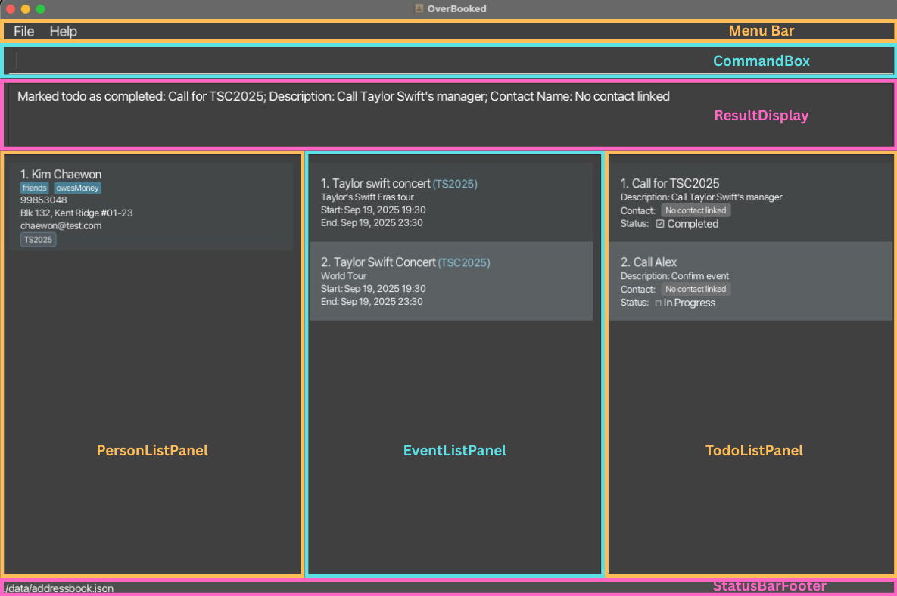
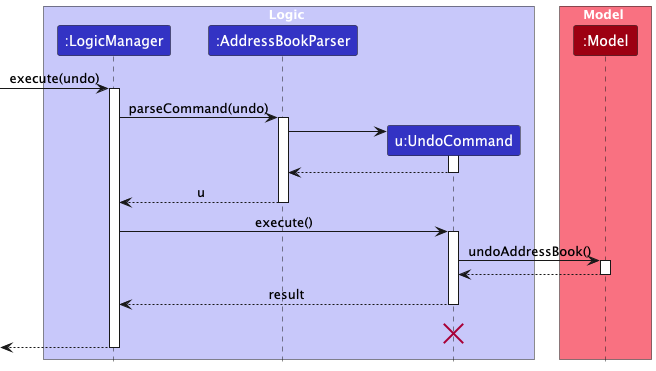

* Table of Contents
{:toc}

--------------------------------------------------------------------------------------------------------------------

## **Acknowledgements**

* Generative AI tools were used for creating detailed Javadoc and test suite creation throughout the development of OverBooked.
* Canva was used to edit some of the images in the documentation. 

--------------------------------------------------------------------------------------------------------------------

## **Setting up, getting started**

Refer to the guide [_Setting up and getting started_](SettingUp.md).

--------------------------------------------------------------------------------------------------------------------

## **Design**

:bulb: **Tip:** The `.puml` files used to create diagrams are in this document `docs/diagrams` folder. Refer to the [_PlantUML Tutorial_ at se-edu/guides](https://se-education.org/guides/tutorials/plantUml.html) to learn how to create and edit diagrams.

### Architecture

The ***Architecture Diagram*** given above explains the high-level design of the App.

Given below is a quick overview of main components and how they interact with each other.

**Main components of the architecture**

**`Main`** (consisting of classes [`Main`](https://github.com/AY2526S1-CS2103T-T10-2/tp/blob/master/src/main/java/seedu/address/Main.java) and [`MainApp`](https://github.com/AY2526S1-CS2103T-T10-2/tp/blob/master/src/main/java/seedu/address/MainApp.java)) is in charge of the app launch and shut down.
* At app launch, it initializes the other components in the correct sequence, and connects them up with each other.
* At shut down, it shuts down the other components and invokes cleanup methods where necessary.

The bulk of the app's work is done by the following four components:

* [**`UI`**](#ui-component): The UI of the App.
* [**`Logic`**](#logic-component): The command executor.
* [**`Model`**](#model-component): Holds the data of the App in memory.
* [**`Storage`**](#storage-component): Reads data from, and writes data to, the hard disk.

[**`Commons`**](#common-classes) represents a collection of classes used by multiple other components.

**How the architecture components interact with each other**

The *Sequence Diagram* below shows how the components interact with each other for the scenario where the user issues the command `delete-contact 1`.

Each of the four main components (also shown in the diagram above),

* defines its *API* in an `interface` with the same name as the Component.
* implements its functionality using a concrete `{Component Name}Manager` class (which follows the corresponding API `interface` mentioned in the previous point.

For example, the `Logic` component defines its API in the `Logic.java` interface and implements its functionality using the `LogicManager.java` class which follows the `Logic` interface. Other components interact with a given component through its interface rather than the concrete class (reason: to prevent outside component's being coupled to the implementation of a component), as illustrated in the (partial) class diagram below.

The sections below give more details of each component.

### UI component

The **API** of this component is specified in [`Ui.java`](https://github.com/AY2526S1-CS2103T-T10-2/tp/blob/master/src/main/java/seedu/address/ui/Ui.java)

The UI consists of a `MainWindow` that is made up of parts e.g.`CommandBox`, `ResultDisplay`, `PersonListPanel`, `StatusBarFooter` etc. All these, including the `MainWindow`, inherit from the abstract `UiPart` class which captures the commonalities between classes that represent parts of the visible GUI. Apart from these parts in the class diagram, `MainWindow` also contains a menu bar.

The image below shows the `MainWindow` and its labelled parts in the UI:

The `MainWindow` also holds a reference to a `HelpWindow`, which inherits from `UiPart` as well. `MainWindow` controls when the `HelpWindow` is shown depending on the user's input.

The `UI` component uses the JavaFx UI framework. The layout of these UI parts are defined in matching `.fxml` files that are in the `src/main/resources/view` folder. For example, the layout of the [`MainWindow`](https://github.com/AY2526S1-CS2103T-T10-2/tp/blob/master/src/main/java/seedu/address/ui/MainWindow.java) is specified in [`MainWindow.fxml`](https://github.com/AY2526S1-CS2103T-T10-2/tp/blob/master/src/main/resources/view/MainWindow.fxml)

The `UI` component,

* executes user commands using the `Logic` component.
* listens for changes to `Model` data so that the UI can be updated with the modified data.
* keeps a reference to the `Logic` component, because the `UI` relies on the `Logic` to execute commands.
* depends on some classes in the `Model` component, as it displays `Person`, `Event` and `Todo` objects residing in the `Model`.

### Logic component

**API** : [`Logic.java`](https://github.com/AY2526S1-CS2103T-T10-2/tp/blob/master/src/main/java/seedu/address/logic/Logic.java)

Here's a (partial) class diagram of the `Logic` component:

The sequence diagram below illustrates the interactions within the `Logic` component, taking `execute("delete-contact 1")` API call as an example.

:information_source: **Note:** The lifeline for `DeleteCommandParser` should end at the destroy marker (X) but due to a limitation of PlantUML, the lifeline continues till the end of diagram.

How the `Logic` component works:

1. When `Logic` is called upon to execute a command, it is passed to an `AddressBookParser` object which in turn creates a parser that matches the command (e.g., `DeleteCommandParser`) and uses it to parse the command.
1. This results in a `Command` object (more precisely, an object of one of its subclasses e.g., `DeleteCommand`) which is executed by the `LogicManager`.
1. The command can communicate with the `Model` when it is executed (e.g. to delete a person). 
   Note that although this is shown as a single step in the diagram above (for simplicity), in the code it can take several interactions (between the command object and the `Model`) to achieve.
1. The result of the command execution is encapsulated as a `CommandResult` object which is returned back from `Logic`.

Here are the other classes in `Logic` (omitted from the class diagram above) that are used for parsing a user command:

How the parsing works (for commands which require parsing):
* When called upon to parse a user command, the `AddressBookParser` class creates an `XYZCommandParser` (`XYZ` is a placeholder for the specific command name e.g., `AddCommandParser`) which uses the other classes shown above to parse the user command and create a `XYZCommand` object (e.g., `AddCommand`) which the `AddressBookParser` returns back as a `Command` object.
* All `XYZCommandParser` classes (e.g., `AddCommandParser`, `DeleteCommandParser`, ...) inherit from the `Parser` interface so that they can be treated similarly where possible e.g, during testing.

### Model component
**API** : [`Model.java`](https://github.com/AY2526S1-CS2103T-T10-2/tp/blob/master/src/main/java/seedu/address/model/Model.java)

The `Model` component,

* stores the address book data i.e., all `Person` objects (which are contained in a `UniquePersonList` object), as well as `Event` objects (which are contained in a `UniqueEventList`) and `Todo` objects (which are contained in a `UniqueTodoList`).
* stores the currently 'selected' `Person` and `Event` objects (e.g., results of a search query) as a separate _filtered_ list which is exposed to outsiders as an unmodifiable `ObservableList<Person>`, `ObservableList<Event>` and `ObservableList<Todo>` respectively, that can be 'observed' e.g. the UI can be bound to this list so that the UI automatically updates when the data in the list change.
* stores a `UserPref` object that represents the user’s preferences. This is exposed to the outside as a `ReadOnlyUserPref` objects.
* does not depend on any of the other three components (as the `Model` represents data entities of the domain, they should make sense on their own without depending on other components)

### Storage component

**API** : [`Storage.java`](https://github.com/AY2526S1-CS2103T-T10-2/tp/blob/master/src/main/java/seedu/address/storage/Storage.java)

The `Storage` component,

- can save both address book data and user preference data in JSON format, and read them back into corresponding objects.
- inherits from both `AddressBookStorage` and `UserPrefStorage`, which means it can be treated as either one (if only the functionality of only one is needed).
- depends on some classes in the `Model` component (because the `Storage` component's job is to save/retrieve objects that belong to the `Model`)

**Enhanced Data Model Support:**
- The storage system has been extended beyond the original AB3 implementation to support a comprehensive event management system.
- `JsonSerializableAddressBook` now handles three distinct data types:
  - **Persons**: Contact information (original AB3 functionality)
  - **Events**: Event details with date/time information
  - **Todos**: Task management items
- Each data type has its own `JsonAdapted` class (`JsonAdaptedPerson`, `JsonAdaptedEvent`, `JsonAdaptedTodo`) for proper JSON serialization/deserialization.
- The storage maintains data integrity by checking for duplicates across all three data types during loading.

### Common classes

Classes used by multiple components are in the `seedu.address.commons` package.

--------------------------------------------------------------------------------------------------------------------

## **Implementation**

This section describes some noteworthy details on how certain features are implemented.

### Add-Event Feature

The Add-Event mechanism is facilitated by the `AddEventCommand` class. It allows users to create and store new events in 
the address book with complete details including name, alias, start time, end time, and description. 

The `EventAlias` serves as a unique identifier for each event

The command implements the following key operations through the `Model` interface:
- Model#hasEvent(Event) — Checks if an event with the same alias already exists in the address book
- Model#addEvent(Event) — Adds a new event to the address book's event list and updates the filtered event list

These operations are backed by the `AddressBook` which maintains a `UniqueEventList` to ensure no duplicate events exist.

Given below is an example usage scenario and how the add-event mechanism behaves at each step.

The following sequence diagram shows how an add-event operation goes through the `Logic` component:

Step 1. The user launches the application. The `AddressBook` is initialised with its saved state, which may contain zero
or more existing events stored in a `UniqueEventList`

Step 2. The user executes `add-event en/Taylor Swift Concert ea/TSC2025 st/2025-09-19 19:30 et/2025-09-19 23:30 d/Taylor's Eras Tour`
to add a new event. The input string is passed to `LogicManager`, which passes it to `AddressBookParser` for parsing.

Step 3. `AddressBookParser` identifies the command word `add-event` and delegates to `AddEventCommandParser`. The parser performs the following steps:

1. Tokenization: The parser uses `ArgumentTokenizer.tokenize()` to seperate the input into an `ArgumentMultimap` containing the
EventName, EventAlias, start time, end time and description.

2. Validation: The parser then checks that
    - All five required prefixes are present
    - The preamble is empty (no text before first prefix)
    - No duplicate prefixes exists (via `verifyNoDuplicatePrefixesFor()`)

If any of the validation fails, a `ParseException` is thrown with the appropriate usage message.

Step 4. The parser uses `ParserUtil` to convert string values into strongly-typed objects

Step 5. A new `Event` object will thus be constructed with these parsed values via its constructor. which will then be
passed on to the `AddEventCommand`

Step 6. When `AddEventCommand#execute(Model)` is called, it first checks for duplicates using `Model#hasEvent(Event)`, which
compares and considers two events to be the same if their `EventAlias` is the same (case-insensitive). 

The following sequence diagram shows how an add-event operation goes through the `Model` component:

Step 7. If no duplicate is found, `Model#addEvent(Event)` is then called. This method;

1. Calls `AddressBook#addEvent(Event)` to add the event to the `UniqueEventList`
2. Calls `updateFilteredEventList(PREDICATE_SHOW_ALL_EVENTS)` to refresh the filtered view

The `UniqueEventList` maintains the internal observable list that JavaFx uses to update the UI automatically

Step 8. After successful addition, a CommandResult is returned with a success message: "New Event added:[formatted event details]". 
The UI automatically reflects the new event in the event list panel.

### \[Proposed\] Undo/redo feature

#### Proposed Implementation

The proposed undo/redo mechanism is facilitated by `VersionedAddressBook`. It extends `AddressBook` with an undo/redo history, stored internally as an `addressBookStateList` and `currentStatePointer`. Additionally, it implements the following operations:

* `VersionedAddressBook#commit()` — Saves the current address book state in its history.
* `VersionedAddressBook#undo()` — Restores the previous address book state from its history.
* `VersionedAddressBook#redo()` — Restores a previously undone address book state from its history.

These operations are exposed in the `Model` interface as `Model#commitAddressBook()`, `Model#undoAddressBook()` and `Model#redoAddressBook()` respectively.

Given below is an example usage scenario and how the undo/redo mechanism behaves at each step.

Step 1. The user launches the application for the first time. The `VersionedAddressBook` will be initialized with the initial address book state, and the `currentStatePointer` pointing to that single address book state.

Step 2. The user executes `delete-contact 5` command to delete the 5th person in the address book. The `delete-contact` command calls `Model#commitAddressBook()`, causing the modified state of the address book after the `delete-contact 5` command executes to be saved in the `addressBookStateList`, and the `currentStatePointer` is shifted to the newly inserted address book state.

Step 3. The user executes `add-contact n/David …​` to add a new person. The `add-contact` command also calls `Model#commitAddressBook()`, causing another modified address book state to be saved into the `addressBookStateList`.

:information_source: **Note:** If a command fails its execution, it will not call `Model#commitAddressBook()`, so the address book state will not be saved into the `addressBookStateList`.

Step 4. The user now decides that adding the person was a mistake, and decides to undo that action by executing the `undo` command. The `undo` command will call `Model#undoAddressBook()`, which will shift the `currentStatePointer` once to the left, pointing it to the previous address book state, and restores the address book to that state.

:information_source: **Note:** If the `currentStatePointer` is at index 0, pointing to the initial AddressBook state, then there are no previous AddressBook states to restore. The `undo` command uses `Model#canUndoAddressBook()` to check if this is the case. If so, it will return an error to the user rather
than attempting to perform the undo.

The following sequence diagram shows how an undo operation goes through the `Logic` component:

:information_source: **Note:** The lifeline for `UndoCommand` should end at the destroy marker (X) but due to a limitation of PlantUML, the lifeline reaches the end of diagram.

Similarly, how an undo operation goes through the `Model` component is shown below:

The `redo` command does the opposite — it calls `Model#redoAddressBook()`, which shifts the `currentStatePointer` once to the right, pointing to the previously undone state, and restores the address book to that state.

:information_source: **Note:** If the `currentStatePointer` is at index `addressBookStateList.size() - 1`, pointing to the latest address book state, then there are no undone AddressBook states to restore. The `redo` command uses `Model#canRedoAddressBook()` to check if this is the case. If so, it will return an error to the user rather than attempting to perform the redo.

Step 5. The user then decides to execute the command `list-contacts`. Commands that do not modify the address book, such as `list-contacts`, will usually not call `Model#commitAddressBook()`, `Model#undoAddressBook()` or `Model#redoAddressBook()`. Thus, the `addressBookStateList` remains unchanged.

Step 6. The user executes `clear`, which calls `Model#commitAddressBook()`. Since the `currentStatePointer` is not pointing at the end of the `addressBookStateList`, all address book states after the `currentStatePointer` will be purged. Reason: It no longer makes sense to redo the `add-contact n/David …​` command. This is the behavior that most modern desktop applications follow.

The following activity diagram summarizes what happens when a user executes a new command:

#### Design considerations

**Aspect: How undo & redo executes:**

* **Alternative 1 (current choice):** Saves the entire address book.
  * Pros: Easy to implement.
  * Cons: May have performance issues in terms of memory usage.

* **Alternative 2:** Individual command knows how to undo/redo by
  itself.
  * Pros: Will use less memory (e.g. for `delete-contact`, just save the person being deleted).
  * Cons: We must ensure that the implementation of each individual command are correct.

--------------------------------------------------------------------------------------------------------------------

## **Documentation, logging, testing, configuration, dev-ops**

* [Documentation guide](Documentation.md)
* [Testing guide](Testing.md)
* [Logging guide](Logging.md)
* [Configuration guide](Configuration.md)
* [DevOps guide](DevOps.md)

--------------------------------------------------------------------------------------------------------------------

## **Appendix: Requirements**

### Product scope

**Target user profile**:

* Event planner who has to operate and liaise with various stakeholders to host events
* Has to juggle multiple events
* Has tight deadlines
* Value time and efficiency
* Can type fast

**Value proposition**:
Provides event planners with a single, organized hub for managing all contacts related to their events, reducing the chaos of scattered information. It ensures quick access to the right people at the right time, helping planners stay in control and deliver seamless, stress-free experiences.

### User stories

Priorities: High (must have) - `* * *`, Medium (nice to have) - `* *`, Low (unlikely to have) - `*`

| Priority | As a …​       | I want to …​                   | So that I can…​                                                    |
|----------|---------------|--------------------------------|--------------------------------------------------------------------|
| `* * *`  | event planner | add a contact                  | store contact information                                          |
| `* * *`  | event planner | view all contacts              | quickly obtain information to contact anyone involved in my events |
| `* * *`  | event planner | edit a contact                 | keep contacts' information accurate and updated                    |
| `* * *`  | event planner | delete a contact               | remove irrelevant people                                           |
| `* * *`  | event planner | find contacts by name          | quickly locate someone specific without going through entire list  |
| `* * *`  | event planner | add an event                   | store events to plan for                                           |
| `* * *`  | event planner | view all events                | view all the upcoming events                                       |
| `* * *`  | event planner | edit an event                  | update event details when details change                           |
| `* * *`  | event planner | delete an event                | remove canceled or past events                                     |
| `* * *`  | event planner | link a contact to an event     | know which event a contact is involved in                          |
| `* * *`  | event planner | unlink a contact from an event | remove incorrect or old associations                               |
| `* * *`  | event planner | find contacts by event         | view all people associated with a specific event                   |
| `* * *`  | event planner | find events by alias           | quickly locate an event without going through the entire list      |
| `* * *`  | event planner | clear all data                 | manage my events from blank slate                                  |
| `* *`    | event planner | add a todo                     | store information about tasks to be done                           |
| `* *`    | event planner | view all todos                 | view all the tasks on my plate                                     |
| `* *`    | event planner | delete a todo                  | remove completed or irrelevant tasks                               |
| `* `     | event planner | mark a todo as completed       | keep track of what I have already done                             |
| `* `     | event planner | unmark a todo as incomplete    | reopen tasks when needed                                           |
| `*`      | event planner | edit a todo                    | update a task’s information when details change                    |

### Use cases

(For all use cases below, the **System** is `OverBooked` and the **Actor** is the `user`, unless specified otherwise)

**Use case: UC1 - Add a contact**

**MSS**

1. User requests to add a contact with the required details.
2. OverBooked adds the contact.
3. OverBooked updates the list.

Use case ends.

**Extensions**

* 1a. User uses the invalid format or parameters.
    * 1a1. OverBooked informs the user of the error and displays the correct format.

Use case ends.

* 1b. User tries to add a contact with the same name.
    * 1b1. OverBooked informs the user that the contact already exists.

Use case ends.

**Use case: UC2 - List contacts**

**MSS**

1. User requests to view the list of contacts.
2. OverBooked shows the list of contacts.

Use case ends.

**Use case: UC3 - Edit a contact**

**MSS**

1. User requests to edit a particular contact with the updated details.
2. OverBooked updates the contact.
3. OverBooked updates the list.

Use case ends.

**Extensions**

* 1a. User uses the invalid format or parameters.
    * 1a1. OverBooked informs the user of the error and displays the correct format.

Use case ends.

* 1b. The new contact name is already used by another existing contact.
    * 1b1. OverBooked informs the user that contact already exists.

Use case ends.

**Use case: UC4 - Find contact by contact name**

**MSS**

1. User types in keywords to search for contacts.
2. OverBooked shows a list of contacts with matching keywords.

Use case ends.

**Extensions**

* 1a. User uses the invalid format or parameters.
    * 1a1. OverBooked informs the user of the error and displays the correct format.

Use case ends.

**Use case: UC5 - Delete a contact**

**MSS**

1. User requests to delete a contact.
2. OverBooked removes the contact.
3. OverBooked updates the list.

Use case ends.

**Extensions**

* 1a. Index provided by user is invalid.
    * 1a1. OverBooked informs user that the contact index is invalid.

Use case ends.

**Use case: UC6 - Add an event**

**MSS**

1. User requests to add an event with the required details.
2. OverBooked adds the event.
3. OverBooked updates the list.

Use case ends.

**Extensions**

* 1a. User uses the invalid format or parameters.
    * 1a1. OverBooked informs the user of the error and displays the correct format.

Use case ends.

* 1b. An existing event has the same alias.
  * 1b1. OverBooked informs the user that the event already exists.

Use case ends.

**Use case: UC7 - Link contacts to an event**

**MSS**

1. User requests to link one or more contacts to an event using their displayed index and event alias.
2. OverBooked links the contact(s) to the specified event.
3. OverBooked updates the list to show the linked event.

Use case ends.

**Extensions**
* 1a. User inputs invalid format or parameters.
    * 1a1. OverBooked informs user of the error and displays the correct format.

Use case ends.

* 1b. One or more index provided by user is invalid.
    * 1b1. OverBooked informs user that the contact index is invalid.

Use case ends.

* 1c. User inputs a non-existent event alias.
    * 1c1. OverBooked informs the user that the event was not found.

Use case ends.

**Use case: UC8 - Unlink contacts from events**

**MSS**

1. User requests to unlink one or more contacts from their linked events using their displayed indexes.
2. OverBooked unlinks the contact(s) from their events.
3. OverBooked updates the list to show the contacts are no longer linked.

Use case ends.

**Extensions**
* 1a. User inputs invalid format or parameters.
    * 1a1. OverBooked informs user of the error and displays the correct format.

Use case ends.

* 1b. One or more index provided by user is invalid.
    * 1b1. OverBooked informs user that the contact index is invalid.

Use case ends.

**Use case: UC9 - List events**

**MSS**

1. User requests to view the list of events.
2. OverBooked shows the list of events.

Use case ends.

**Use case: UC10 - Edit an event**

**MSS**

1. User requests to edit an event and provides details of the parameters that should be edited.
2. OverBooked informs the user that the edit was successful.
3. OverBooked displays the updated event list.

Use case ends.

**Extensions**

* 1a. User uses the invalid format or parameters.
  * 1a1. OverBooked displays the correct format to the user.

Use case ends.

* 1b. The event with the specified alias does not exist. 
  * 1b1. OverBooked informs user that the event could not be found.
  
Use case ends.

* 1c. User does not provide any parameters to edit.
  * 1c1. OverBooked informs user that they need to provide at least 1 parameter.

Use case ends.

* 1d. Start time of the edited event is the same or after its end time.
  * 1d1. OverBooked informs user that the start time has to be before the end time.
  
Use case ends.

**Use case: UC11 - Find events**

**MSS**

1. User requests to find an event with the specified keywords.
2. OverBooked displays all events that match the given keywords.
3. OverBooked informs the user the number of events found.

Use case ends.

**Extensions**

* 1a. User uses the invalid format or does not specify any keywords.
  * 1a1. OverBooked displays the correct format to the user.

Use case ends.

**Use case: UC12 - Delete an event**

**MSS**

1. User requests to delete an event.
2. OverBooked deletes the specified event.
3. OverBooked updates and displays the new event list.

Use case ends.

**Extensions**

* 1a. The event could not be found. 
    * 1a1. OverBooked shows an error message.

Use case ends.

**Use case: UC13 - Find contacts by event**

**MSS**

1. User requests to find contacts associated with the event.
2. OverBooked shows a list of contacts that are associated with the event.

Use case ends.

**Extensions**

* 1a. User uses the invalid format or parameters.
    * 1a1. OverBooked informs the user of the error and displays the correct format.

Use case ends.

* 1b. The event could not be found. 
   * 1b1. OverBooked shows an error message.

Use case ends.

**Use case: UC14 - Add a todo**

**MSS**
1. User requests to add a todo with the required details.
2. OverBooked adds the todo.
3. OverBooked updates the todo list.

Use case ends.

**Extensions**

* 1a. User uses the invalid format or parameters.
    * 1a1. OverBooked informs the user of the error and displays the correct format.

Use case ends.

* 1b. An existing todo has the same name and description.
  * 1b1. OverBooked informs the user that the todo already exists.

Use case ends.

**Use case: UC15 - Edit a todo**

**MSS**

1. User requests to edit a specific todo using its displayed index and provides the fields to update.
2. OverBooked edits the todo with the new details.
3. OverBooked updates the todo list to show the edited todo.

Use case ends.

**Extensions**

* 1a. User uses invalid format or parameters.
    * 1a1. OverBooked informs the user of the error and displays the correct format.

Use case ends.

* 1b. User provides an invalid index.
    * 1b1. OverBooked informs the user that the todo index is invalid.

Use case ends.

* 1c. User does not provide any fields to edit.
    * 1c1. OverBooked informs the user that at least one field must be provided.

Use case ends.

* 1d. User provides a contact name that does not exist.
    * 1d1. OverBooked informs the user that the contact was not found.

Use case ends.

* 1e. An existing todo has the same name and description.
  * 1e1. OverBooked informs the user that the todo already exists.

Use case ends.

**Use case: UC16 - Delete a todo**

**MSS** 
1. User requests to delete a todo.
2. OverBooked deletes the specified todo.
3. OverBooked updates the todo list.

Use case ends.

**Extensions**
* 1a. User provides an invalid index.
    * 1a1. OverBooked informs the user of the error.

Use case ends.

**Use case: UC17 - List todos**

**MSS**
1. User requests to view the list of todos.
2. OverBooked shows the list of todos.

Use case ends.

**Use case: UC18 - Mark a todo as complete**

**MSS**
1. User requests to mark a todo as complete.
2. OverBooked marks the todo as complete.
3. OverBooked updates the list to reflect the marking.

Use case ends.

**Extensions**

* 1a. Index provided by user is invalid.
    * 1a1. OverBooked informs user that the todo index is invalid.

Use case ends.

**Use case: UC19 - Mark a todo as incomplete**

**MSS**
1. User requests to mark a todo as incomplete.
2. OverBooked marks the todo as incomplete.
3. OverBooked updates the list to reflect the marking.

Use case ends.

**Extensions**

* 1a. Index provided by user is invalid.
    * 1a1. OverBooked informs user that the todo index is invalid.

Use case ends.

### Non-Functional Requirements

1. Should work on any _mainstream OS_ as long as it has Java `17` or above installed.
2. Should be able to hold up to 1000 persons, 1000 events and 1000 todos without a noticeable sluggishness in performance for typical usage.
3. A user with above average typing speed for regular English text (i.e. not code, not system admin commands) should be able to accomplish most of the tasks faster using commands than using the mouse.
4. Commands should be case-insensitive.
5. The GUI should update in real-time when contacts/events/todos are added, listed or deleted.
6. Invalid inputs should never crash the system; instead, appropriate error messages should be shown.
7. All saved data must survive application restarts.

### Glossary

* **Mainstream OS**: Windows, Linux, Unix, MacOS
* **CLI(Command Line Interface)**: A text-based interface where the user types commands to interact with the application.
* **GUI(Graphical User Interface)**: The visual interface of the app (panels, windows) built using JavaFX.
* **Contact**: Any person in `OverBooked`. This term is used interchangeably with the term "person".
* **Todo**: A task that the event planner needs to do.

--------------------------------------------------------------------------------------------------------------------

## **Appendix: Planned Enhancements**

Team size: 5

1. **Support associating contacts with multiple events**  
   Currently, each contact can only be linked to a single event. This enhancement will allow a contact to be associated with multiple events simultaneously, improving flexibility for users managing recurring or related events.

2. **Introduce alternative short command aliases**  
   Provide shorter command words (e.g., `lc` as an alias for `list-contacts`) to enhance efficiency and user experience, especially for experienced users who prefer quicker interactions.

3. **Use both name and phone number as unique identifiers for contacts**  
   Modify the contact model so that uniqueness is determined by a combination of name and phone number, instead of name alone. This ensures users can store multiple contacts sharing the same name but with different numbers.

4. **Enable international phone number formats**  
   Expand phone number validation to support international formats (e.g., including `+`, `/`, and `()` symbols). This will be implemented via enhanced regex patterns and improved parsing to handle a wider range of valid cases.

5. **Allow prefixes within data field values using quotation marks**  
   Commands currently fail when a data field (e.g., description) contains a prefix keyword. The parser will be enhanced to support quoted values (e.g., `d/"Discuss n/next steps"`), enabling users to include prefixes safely within input text.

6. **Improve UI scaling for displaying of lists**  
   When the application window width is reduced, longer details are currently cut off. Responsive resizing will be implemented so text automatically wraps or dynamically adjusts, ensuring all content remains visible.

7. **Enable vertical scaling for command output panel**  
   The command output box currently requires horizontal scrolling for long messages. Enhancing it to support vertical scaling or text wrapping will improve readability and reduce user friction when there are long extended command outputs.

--------------------------------------------------------------------------------------------------------------------

## **Appendix: Instructions for manual testing**

Given below are instructions to test the app manually.

:information_source: **Note:** These instructions only provide a starting point for testers to work on;
testers are expected to do more *exploratory* testing.

### Launch and shutdown

1. Initial launch

   1. Download the jar file and copy into an empty folder
   2. Open a terminal and navigate to that folder using the `cd` command
   3. Run the application by typing `java -jar OverBooked.jar`

1. Saving window preferences

   1. Resize the window to an optimum size. Move the window to a different location. Close the window.

   1. Re-launch the app by typing `java -jar OverBooked.jar` again. 
       Expected: The most recent window size and location is retained.

### Deleting a person

1. Deleting a person while all persons are being shown

   1. Prerequisites: List all persons using the `list-contacts` command. Multiple persons in the list.

   1. Test case: `delete-contact 1` 
      Expected: First contact is deleted from the list. Details of the deleted contact shown in the status message. 

   1. Test case: `delete-contact 0` 
      Expected: No person is deleted. Error details shown in the status message. 

   1. Other incorrect delete commands to try: `delete-contact`, `delete-contact x`, `...` (where x is larger than the list size) 
      Expected: Similar to previous.

### Saving data

1. Dealing with missing/corrupted data files

   * If the application cannot find the data file (addressbook.json), it automatically creates a new file upon startup.
   * If the data file becomes an invalid json file or data field values no longer fall within the given restrictions after user edits, the application creates a new empty file to replace it. In some cases, database consistency may not be guaranteed.

