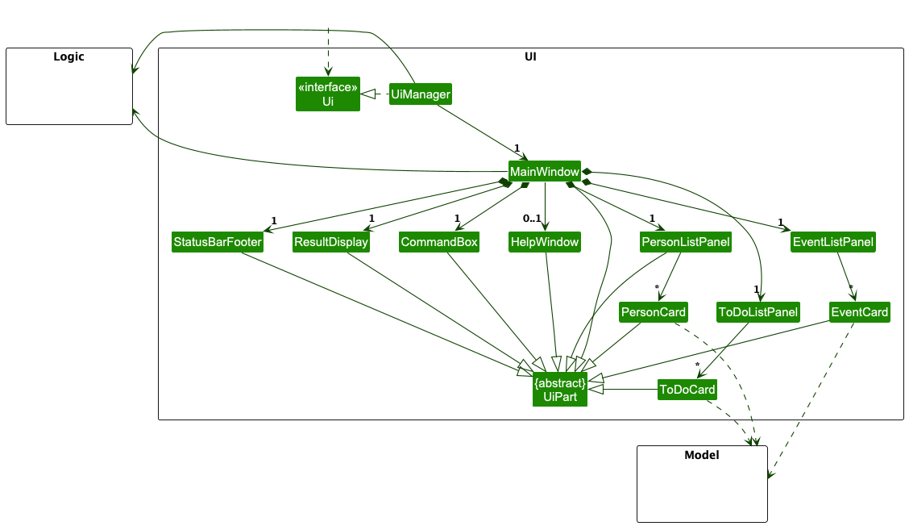
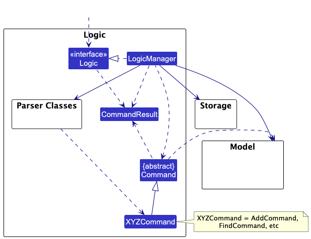
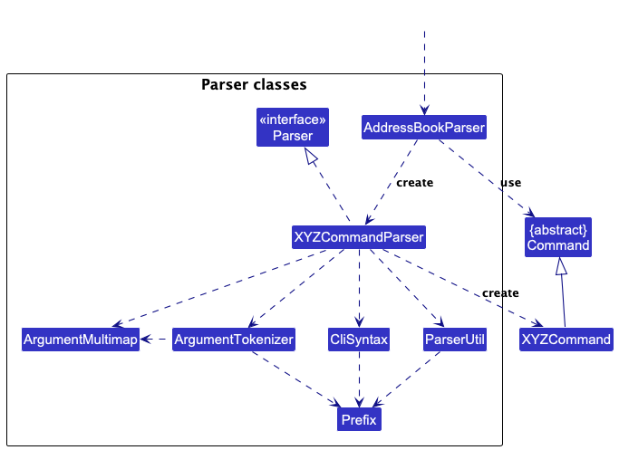
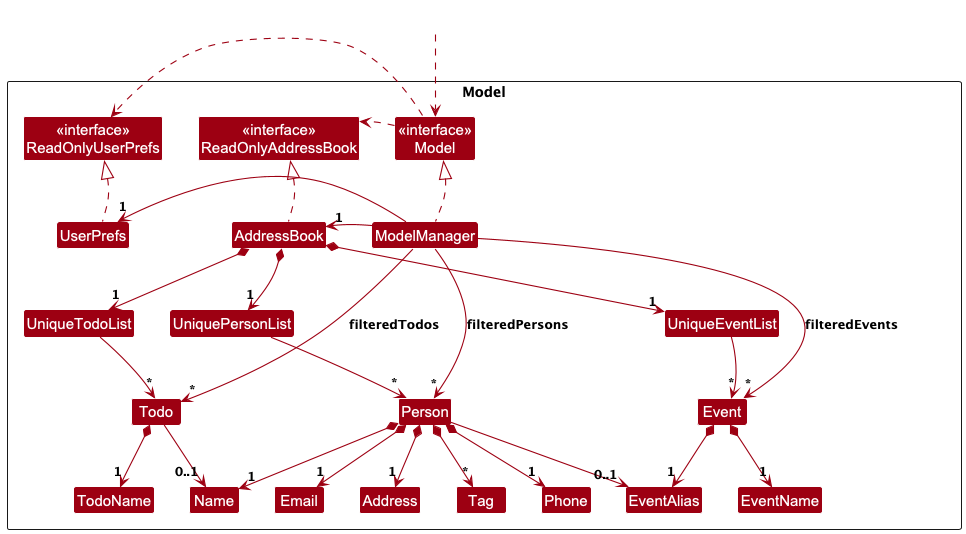
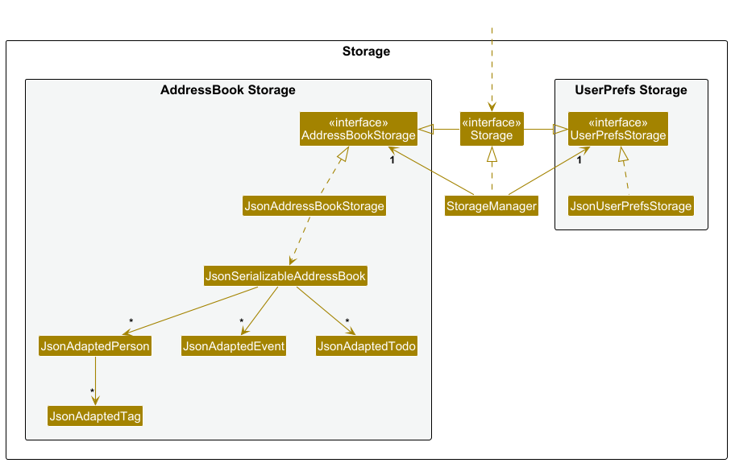
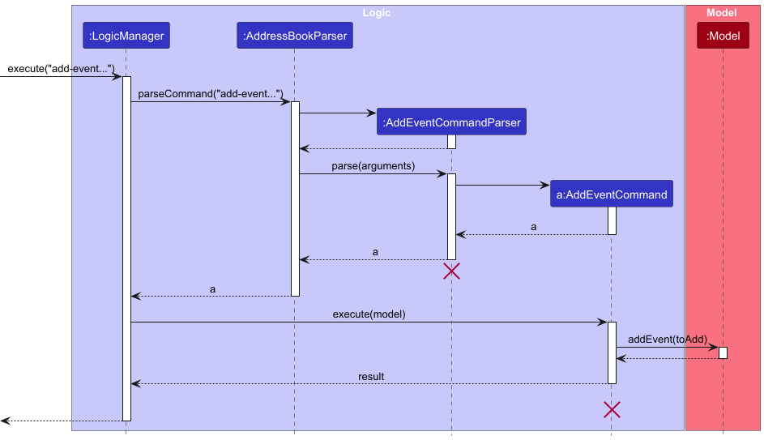
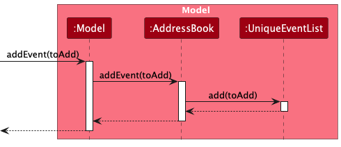
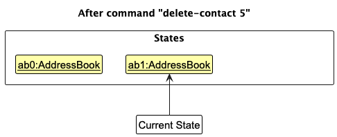
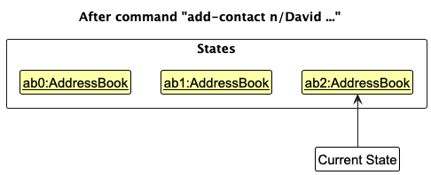
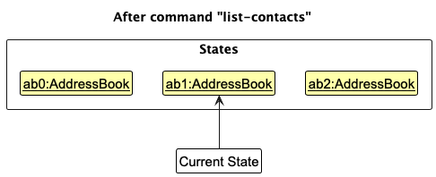

* Table of Contents
{:toc}

--------------------------------------------------------------------------------------------------------------------

## **Acknowledgements**

* {list here sources of all reused/adapted ideas, code, documentation, and third-party libraries -- include links to the original source as well}

--------------------------------------------------------------------------------------------------------------------

## **Setting up, getting started**

Refer to the guide [_Setting up and getting started_](SettingUp.md).

--------------------------------------------------------------------------------------------------------------------

## **Design**

:bulb: **Tip:** The `.puml` files used to create diagrams are in this document `docs/diagrams` folder. Refer to the [_PlantUML Tutorial_ at se-edu/guides](https://se-education.org/guides/tutorials/plantUml.html) to learn how to create and edit diagrams.

### Architecture

The ***Architecture Diagram*** given above explains the high-level design of the App.

Given below is a quick overview of main components and how they interact with each other.

**Main components of the architecture**

**`Main`** (consisting of classes [`Main`](https://github.com/se-edu/addressbook-level3/tree/master/src/main/java/seedu/address/Main.java) and [`MainApp`](https://github.com/se-edu/addressbook-level3/tree/master/src/main/java/seedu/address/MainApp.java)) is in charge of the app launch and shut down.
* At app launch, it initializes the other components in the correct sequence, and connects them up with each other.
* At shut down, it shuts down the other components and invokes cleanup methods where necessary.

The bulk of the app's work is done by the following four components:

* [**`UI`**](#ui-component): The UI of the App.
* [**`Logic`**](#logic-component): The command executor.
* [**`Model`**](#model-component): Holds the data of the App in memory.
* [**`Storage`**](#storage-component): Reads data from, and writes data to, the hard disk.

[**`Commons`**](#common-classes) represents a collection of classes used by multiple other components.

**How the architecture components interact with each other**

The *Sequence Diagram* below shows how the components interact with each other for the scenario where the user issues the command `delete 1`.

Each of the four main components (also shown in the diagram above),

* defines its *API* in an `interface` with the same name as the Component.
* implements its functionality using a concrete `{Component Name}Manager` class (which follows the corresponding API `interface` mentioned in the previous point.

For example, the `Logic` component defines its API in the `Logic.java` interface and implements its functionality using the `LogicManager.java` class which follows the `Logic` interface. Other components interact with a given component through its interface rather than the concrete class (reason: to prevent outside component's being coupled to the implementation of a component), as illustrated in the (partial) class diagram below.

The sections below give more details of each component.

### UI component

The **API** of this component is specified in [`Ui.java`](https://github.com/se-edu/addressbook-level3/tree/master/src/main/java/seedu/address/ui/Ui.java)

The UI consists of a `MainWindow` that is made up of parts e.g.`CommandBox`, `ResultDisplay`, `PersonListPanel`, `StatusBarFooter` etc. All these, including the `MainWindow`, inherit from the abstract `UiPart` class which captures the commonalities between classes that represent parts of the visible GUI.

The `UI` component uses the JavaFx UI framework. The layout of these UI parts are defined in matching `.fxml` files that are in the `src/main/resources/view` folder. For example, the layout of the [`MainWindow`](https://github.com/se-edu/addressbook-level3/tree/master/src/main/java/seedu/address/ui/MainWindow.java) is specified in [`MainWindow.fxml`](https://github.com/se-edu/addressbook-level3/tree/master/src/main/resources/view/MainWindow.fxml)

The `UI` component,

* executes user commands using the `Logic` component.
* listens for changes to `Model` data so that the UI can be updated with the modified data.
* keeps a reference to the `Logic` component, because the `UI` relies on the `Logic` to execute commands.
* depends on some classes in the `Model` component, as it displays `Person` object residing in the `Model`.

### Logic component

**API** : [`Logic.java`](https://github.com/se-edu/addressbook-level3/tree/master/src/main/java/seedu/address/logic/Logic.java)

Here's a (partial) class diagram of the `Logic` component:

The sequence diagram below illustrates the interactions within the `Logic` component, taking `execute("delete 1")` API call as an example.

:information_source: **Note:** The lifeline for `DeleteCommandParser` should end at the destroy marker (X) but due to a limitation of PlantUML, the lifeline continues till the end of diagram.

How the `Logic` component works:

1. When `Logic` is called upon to execute a command, it is passed to an `AddressBookParser` object which in turn creates a parser that matches the command (e.g., `DeleteCommandParser`) and uses it to parse the command.
1. This results in a `Command` object (more precisely, an object of one of its subclasses e.g., `DeleteCommand`) which is executed by the `LogicManager`.
1. The command can communicate with the `Model` when it is executed (e.g. to delete a person). 
   Note that although this is shown as a single step in the diagram above (for simplicity), in the code it can take several interactions (between the command object and the `Model`) to achieve.
1. The result of the command execution is encapsulated as a `CommandResult` object which is returned back from `Logic`.

Here are the other classes in `Logic` (omitted from the class diagram above) that are used for parsing a user command:

How the parsing works:
* When called upon to parse a user command, the `AddressBookParser` class creates an `XYZCommandParser` (`XYZ` is a placeholder for the specific command name e.g., `AddCommandParser`) which uses the other classes shown above to parse the user command and create a `XYZCommand` object (e.g., `AddCommand`) which the `AddressBookParser` returns back as a `Command` object.
* All `XYZCommandParser` classes (e.g., `AddCommandParser`, `DeleteCommandParser`, ...) inherit from the `Parser` interface so that they can be treated similarly where possible e.g, during testing.

### Model component
**API** : [`Model.java`](https://github.com/se-edu/addressbook-level3/tree/master/src/main/java/seedu/address/model/Model.java)

The `Model` component,

* stores the address book data i.e., all `Person` objects (which are contained in a `UniquePersonList` object).
* stores the currently 'selected' `Person` objects (e.g., results of a search query) as a separate _filtered_ list which is exposed to outsiders as an unmodifiable `ObservableList<Person>` that can be 'observed' e.g. the UI can be bound to this list so that the UI automatically updates when the data in the list change.
* stores a `UserPref` object that represents the user’s preferences. This is exposed to the outside as a `ReadOnlyUserPref` objects.
* does not depend on any of the other three components (as the `Model` represents data entities of the domain, they should make sense on their own without depending on other components)

:information_source: **Note:** An alternative (arguably, a more OOP) model is given below. It has a `Tag` list in the `AddressBook`, which `Person` references. This allows `AddressBook` to only require one `Tag` object per unique tag, instead of each `Person` needing their own `Tag` objects. 

### Storage component

**API** : [`Storage.java`](https://github.com/se-edu/addressbook-level3/tree/master/src/main/java/seedu/address/storage/Storage.java)

The `Storage` component,
* can save both address book data and user preference data in JSON format, and read them back into corresponding objects.
* inherits from both `AddressBookStorage` and `UserPrefStorage`, which means it can be treated as either one (if only the functionality of only one is needed).
* depends on some classes in the `Model` component (because the `Storage` component's job is to save/retrieve objects that belong to the `Model`)

### Common classes

Classes used by multiple components are in the `seedu.address.commons` package.

--------------------------------------------------------------------------------------------------------------------

## **Implementation**

This section describes some noteworthy details on how certain features are implemented.

## Add-Event Feature

The Add-Event mechanism is facilitated by the `AddEventCommand` class. It allows users to create and store new events in 
the address book with complete details including name, alias, start time, end time, and description. 

The `EventAlias` serves as a unique identifier for each event

The command implements the following key operations through the `Model` interface:
- Model#hasEvent(Event) — Checks if an event with the same alias already exists in the address book
- Model#addEvent(Event) — Adds a new event to the address book's event list and updates the filtered event list

These operations are backed by the `AddreessBook` which maintains a `UniqueEventList` to ensure no duplicate events exist.

Given below is an example usage scenario and how the add-event mechanism behaves at each step.

The following sequence diagram shows how an add-event operation goes through the `Logic` component:

Step 1. The user launches the application. The `AddressBook` is initialised with its saved state, which may contain zero
or more existing events stored in a `UniqueEventList`

Step 2. The user executes `add-event en/Taylor Swift Concert ea/TSC2025 s/2025-09-19 19:30 e/2025-09-19 23:30 d/Taylor's Eras Tour`
to add a new event. The input string is passed to `LogicManager`, which passes it to `AddressBookParser` for parsing.

Step 3. `AddressBookParser` identifies the command word `add-event` and delegates to `AddEventCommandParser`. The parser performs the following steps:

1. Tokenization: The parser uses `Argument.Tokenizer.tokenize()` to seperate the input into an `ArgumentMultimap` containing:
2. Validation: The parser then checks that
    - All five required prefixes are present
    - The preamble is empty (no text before first prefix)
    - No duplicate prefixes exists (via `verifyNoDuplicatePrefixesFor()`)

If any of the validation fails, a `ParseException` is thrown with the appropriate usage message.

Step 4. The parser uses `ParserUtil` to convert string values into strongly-typed objects

Step 5. A new `Event` object will thus be constructed with these parsed values via its constructor. which will then be
passed on to the `AddEventCommand`

Step 6. When `AddEventCommand#execute(Model)` is called, it first checks for duplicates using `Model#hasEvent(Event)`, which
compares and considers two events to be the same if their `EventAlias` is the same (case-insensitive). 

The following sequence diagram shows how an add-event operation goes through the `Model` component:

Step 7. If no duplicate is found, `Model#addEvent(Event)` is then called. This method;

1. Calls `AddressBook#addEvent(Event)` to add the event to the `UniqueEventList`
2. Calls `updateFilteredEventLIst(PREDICATE_SHOW_ALL_EVENTS)` to refresh the filtered view

The `UniqueEventList` maintains the internal observable list that JavaFx uses to update the UI automatically

Step 8. After successful addition, a CommandResult is returend with a success message: "New Event added:[formatted event details]". 
The UI automatically reflects the new event in the event list panel.

### \[Proposed\] Undo/redo feature

#### Proposed Implementation

The proposed undo/redo mechanism is facilitated by `VersionedAddressBook`. It extends `AddressBook` with an undo/redo history, stored internally as an `addressBookStateList` and `currentStatePointer`. Additionally, it implements the following operations:

* `VersionedAddressBook#commit()` — Saves the current address book state in its history.
* `VersionedAddressBook#undo()` — Restores the previous address book state from its history.
* `VersionedAddressBook#redo()` — Restores a previously undone address book state from its history.

These operations are exposed in the `Model` interface as `Model#commitAddressBook()`, `Model#undoAddressBook()` and `Model#redoAddressBook()` respectively.

Given below is an example usage scenario and how the undo/redo mechanism behaves at each step.

Step 1. The user launches the application for the first time. The `VersionedAddressBook` will be initialized with the initial address book state, and the `currentStatePointer` pointing to that single address book state.

Step 2. The user executes `delete 5` command to delete the 5th person in the address book. The `delete` command calls `Model#commitAddressBook()`, causing the modified state of the address book after the `delete 5` command executes to be saved in the `addressBookStateList`, and the `currentStatePointer` is shifted to the newly inserted address book state.

Step 3. The user executes `add n/David …​` to add a new person. The `add` command also calls `Model#commitAddressBook()`, causing another modified address book state to be saved into the `addressBookStateList`.

:information_source: **Note:** If a command fails its execution, it will not call `Model#commitAddressBook()`, so the address book state will not be saved into the `addressBookStateList`.

Step 4. The user now decides that adding the person was a mistake, and decides to undo that action by executing the `undo` command. The `undo` command will call `Model#undoAddressBook()`, which will shift the `currentStatePointer` once to the left, pointing it to the previous address book state, and restores the address book to that state.

:information_source: **Note:** If the `currentStatePointer` is at index 0, pointing to the initial AddressBook state, then there are no previous AddressBook states to restore. The `undo` command uses `Model#canUndoAddressBook()` to check if this is the case. If so, it will return an error to the user rather
than attempting to perform the undo.

The following sequence diagram shows how an undo operation goes through the `Logic` component:

:information_source: **Note:** The lifeline for `UndoCommand` should end at the destroy marker (X) but due to a limitation of PlantUML, the lifeline reaches the end of diagram.

Similarly, how an undo operation goes through the `Model` component is shown below:

The `redo` command does the opposite — it calls `Model#redoAddressBook()`, which shifts the `currentStatePointer` once to the right, pointing to the previously undone state, and restores the address book to that state.

:information_source: **Note:** If the `currentStatePointer` is at index `addressBookStateList.size() - 1`, pointing to the latest address book state, then there are no undone AddressBook states to restore. The `redo` command uses `Model#canRedoAddressBook()` to check if this is the case. If so, it will return an error to the user rather than attempting to perform the redo.

Step 5. The user then decides to execute the command `list`. Commands that do not modify the address book, such as `list`, will usually not call `Model#commitAddressBook()`, `Model#undoAddressBook()` or `Model#redoAddressBook()`. Thus, the `addressBookStateList` remains unchanged.

Step 6. The user executes `clear`, which calls `Model#commitAddressBook()`. Since the `currentStatePointer` is not pointing at the end of the `addressBookStateList`, all address book states after the `currentStatePointer` will be purged. Reason: It no longer makes sense to redo the `add n/David …​` command. This is the behavior that most modern desktop applications follow.

The following activity diagram summarizes what happens when a user executes a new command:

#### Design considerations:

**Aspect: How undo & redo executes:**

* **Alternative 1 (current choice):** Saves the entire address book.
  * Pros: Easy to implement.
  * Cons: May have performance issues in terms of memory usage.

* **Alternative 2:** Individual command knows how to undo/redo by
  itself.
  * Pros: Will use less memory (e.g. for `delete`, just save the person being deleted).
  * Cons: We must ensure that the implementation of each individual command are correct.

_{more aspects and alternatives to be added}_

### \[Proposed\] Data archiving

_{Explain here how the data archiving feature will be implemented}_

--------------------------------------------------------------------------------------------------------------------

## **Documentation, logging, testing, configuration, dev-ops**

* [Documentation guide](Documentation.md)
* [Testing guide](Testing.md)
* [Logging guide](Logging.md)
* [Configuration guide](Configuration.md)
* [DevOps guide](DevOps.md)

--------------------------------------------------------------------------------------------------------------------

## **Appendix: Requirements**

### Product scope

**Target user profile**:

* Sports hub events planner who has to operate and liaise with various stakeholders to host sports events
* Has to juggle multiple events
* Has tight deadlines
* Value time and efficiency
* Can type fast

**Value proposition**:
Provides event planners with a single, organized hub for managing all contacts related to their events, reducing the chaos of scattered information. It ensures quick access to the right people at the right time, helping planners stay in control and deliver seamless, stress-free experiences.

### User stories

Priorities: High (must have) - `* * *`, Medium (nice to have) - `* *`, Low (unlikely to have) - `*`

| Priority | As a …​                                   | I want to …​                                        | So that I can…​                                             |
|-------|-------------------------------------------|-----------------------------------------------------|-------------------------------------------------------------|
| `* * *` | user                                      | search contacts by name                             | easily obtain their contact details                         |
| `* * *` | user                                      | modify my contact list                              | add and delete relevant contacts accordingly                |
| `* * *` | user                                      | view all information regarding a particular contact | easily contact the person                                   |
| `* * *` | user                                      | access the contacts saved from my previous event    | quickly and efficiently add these contacts to my next event |
| `* * *` | user                                      | add upcoming appointment                            | deconflict clashes while scheduling other appointments      |
| `* *` | user                                      | filter my contacts by event                         | find all the people involved in that specific event         |

### Use cases

(For all use cases below, the **System** is `Overbooked` and the **Actor** is the `user`, unless specified otherwise)

**Use case: UC1 - Add a contact**

**MSS**

1. User requests to add a contact with the required details
2. Overbooked adds the contact
3. Overbooked updates the list

Use case ends.

**Extensions**

* 1a. User uses the invalid format or parameters
    * 1a1. Overbooked informs the user of the error and displays the correct format

Use case ends.

* 1b. User tries to add a contact with the same name
    * 1b1. Overbooked informs the user that the contact already exists

Use case ends.

* 2a. Overbooked is unable to save the new contact list
    * 2a1. Overbooked informs the user of the error

Use case resumes from step 3.

**Use case: UC2 - List contacts**

**MSS**

1. User requests to view the list of contacts
2. Overbooked shows the list of contacts

Use case ends.

**Extensions**

* 1a. Overbooked is unable to get the list of contacts
    * 1a1. Overbooked shows an error message

Use case ends.

* 1b. Overbooked has no contacts saved
    * 1b1. Overbooked informs the user that there are no contacts

Use case ends.

**Use case: UC3 - Edit a contact**

**Use case: UC4 - Find contact by contact name**

**MSS**

1. User types in keywords to search for contacts
2. Overbooked shows a list of contacts with matching keywords

Use case ends.

**Extensions**

* 1a. Overbooked did not find any contacts with matching keywords
    * 1a1. Overbooked shows user a message saying no matching keywords

Use case ends.

**Use case: UC5 - Delete a contact**

**MSS**

1. User deletes a contact
2. Overbooked removes the contact from the database
3. Overbooked updates the list

Use case ends.

**Extensions**

* 1a. User tries to delete a contact that does not exist in the database
    * 1a1. Overbooked shows an error message to the user

Use case ends.

* 2a. Overbooked faced some errors in saving the contact list
    * 2a1. Overbooked informs the user of the error

Use case ends.

**Use case: UC6 - Add an event**

**MSS**

1. User requests to add an event with the required details
2. OverBooked adds the event
3. OverBooked updates the list

Use case ends.

**Extensions**

* 1a. User provides an unacceptable value for the argument
    * 1a1. OverBooked informs the user of the acceptable values

Use case ends.

* 2a. OverBooked is unable to save the new event
    * 2a1. OverBooked informs the user of the error

Use case resumes from step 3.

**Use case: UC7 - Link contacts to an event**

**Use case: UC8 - Unlink contacts from events**

**Use case: UC9 - List events**

**MSS**

1. User requests to view the list of events
2. Overbooked shows the list of events

Use case ends.

**Extensions**
* 1a. Overbooked is unable to get the list of events
    * 1a1. Overbooked shows an error message

Use case ends.

* 1b. Overbooked has no events saved
    * 1b1. Overbooked informs the user that there are no events

Use case ends.

**Use case: UC10 - Edit an event**

**Use case: UC11 - Find events by alias**

**Use case: UC12 - Delete an event**

**MSS**

1. User requests to delete an event by specifying its index in the event list.
2. Event Planner verifies that the index is valid.
3. Event Planner deletes the specified event.
4. Event Planner removes all references to the event from the associated contacts.
5. Event Planner updates and displays the new event list.

Use case ends.

**Extensions**

* 2a. The given index is not a valid positive integer
    * 2a1. Event Planner shows an error message: “Invalid command format. Delete event: Deletes the event identified by the index number used in the event list. Parameters: INDEX(must be a positive integer).”

Use case ends.

* 2b. The given index is greater than the number of displayed events.
    * 2b1. Event Planner shows an error message: “The event index [INDEX] provided is invalid.”

Use case ends.

* 3a. Database update fails.
    * 3a1. Event Planner shows error message: “Failed to save deletion changes. Please restart the app and try again.”

Use case ends.

**Use case: UC13 - Find contacts by event alias**

**Use case: UC14 - Add a todo**

**Use case: UC15 - Edit a todo**

**Use case: UC16 - Delete a todo**

**Use case: UC17 - List todos**

**Use case: UC18 - Mark a todo as complete**

**Use case: UC19 - Mark a todo as incomplete**

### Non-Functional Requirements

1.  Should work on any _mainstream OS_ as long as it has Java `17` or above installed.
2.  Should be able to hold up to 1000 persons without a noticeable sluggishness in performance for typical usage.
3.  A user with above average typing speed for regular English text (i.e. not code, not system admin commands) should be able to accomplish most of the tasks faster using commands than using the mouse.
4. Commands should be case-insensitive.
5. Error messages must be clear, specific and actionable, guiding the user to correct mistakes.
6. The GUI should update in real-time when contacts/events are added, listed or deleted.
7. Placeholder messages must be shown for empty lists so that users do not think the app is unresponsive.
8. Invalid inputs should never crash the system; instead, appropriate error messages should be shown.
9. Duplicate contacts are determined strictly by name and must be rejected.
10. The system must reject invalid command formats, duplicate entries and malformed data consistently.
11. Events with overlapping time intervals must be rejected.
12. All saved data must survive application restarts.
13. Input validation must prevent injection of malicious characters into saved files (e.g. disallow scripts in event names).

*{More to be added}*

### Glossary

* **Mainstream OS**: Windows, Linux, Unix, MacOS
* **Private contact detail**: A contact detail that is not meant to be shared with others
* **CLI(Command Line Interface)**: A text-based interface where the user types commands to interact with the application.
* **GUI(Graphical User Interface)**: The visual interface of the app (buttons, panels, windows) built using JavaFX.
* **Parser**: A component that interprets raw user input strings (e.g., delete 1) and converts them into structured command objects.
* **Command Pattern**: A design pattern where each action (add, delete, list) is encapsulated in its own command class.
* **Event-driven architecture**: A programming paradigm where components react to events (e.g., UI updates when the model changes).
* **ObservableList**: A JavaFX collection type that notifies observers (e.g., UI) automatically when the list changes.
* **Lifeline(in sequence diagrams)**: A vertical dashed line representing the existence of an object during an interaction.
* **Destroy Marker (X)**: Symbol at the end of a lifeline in UML indicating the object termination. 
* **Activity Diagram**: A UML diagram that models workflows or processes, show decision points 
  and actions.
* **State Pointer**:  In undo/redo implementation, refers to the index marking the current state in the version history.
* **AddressBookParser**: A central parser class that delegates parsing to specific command parsers (e.g., AddCommandParser).
* **VersionedAddressBook**: An extension of AddressBook that maintains a history of states to support undo/redo.
* **Upstream Repository**: The original repository from which a project is forked.
* **Origin**: The default name Git assigns to the remote repository from which you cloned your local repo.
* **Force Push**: A Git operation (git push --force) that overwrites the remote branch history 
  with your local history.
* **Detached HEAD**: A Git state where you’ve checked out a specific commit rather than a branch, so new commits don’t belong to any branch.
* **Non-Functional Requirement(NFR)**: A requirement describing how the system should behave (e.g., performance, usability), not what it should do.
* **Exploratory Testing**: Testing approach where testers actively explore the app without a strict script, often to uncover edge cases.
* **PlantUML**: A tool used to write text-based UML diagrams that can be rendered into images.

--------------------------------------------------------------------------------------------------------------------

## **Appendix: Instructions for manual testing**

Given below are instructions to test the app manually.

:information_source: **Note:** These instructions only provide a starting point for testers to work on;
testers are expected to do more *exploratory* testing.

### Launch and shutdown

1. Initial launch

   1. Download the jar file and copy into an empty folder

   1. Double-click the jar file Expected: Shows the GUI with a set of sample contacts. The window size may not be optimum.

1. Saving window preferences

   1. Resize the window to an optimum size. Move the window to a different location. Close the window.

   1. Re-launch the app by double-clicking the jar file. 
       Expected: The most recent window size and location is retained.

1. _{ more test cases …​ }_

### Deleting a person

1. Deleting a person while all persons are being shown

   1. Prerequisites: List all persons using the `list` command. Multiple persons in the list.

   1. Test case: `delete 1` 
      Expected: First contact is deleted from the list. Details of the deleted contact shown in the status message. Timestamp in the status bar is updated.

   1. Test case: `delete 0` 
      Expected: No person is deleted. Error details shown in the status message. Status bar remains the same.

   1. Other incorrect delete commands to try: `delete`, `delete x`, `...` (where x is larger than the list size) 
      Expected: Similar to previous.

1. _{ more test cases …​ }_

### Saving data

1. Dealing with missing/corrupted data files

   1. _{explain how to simulate a missing/corrupted file, and the expected behavior}_

1. _{ more test cases …​ }_
