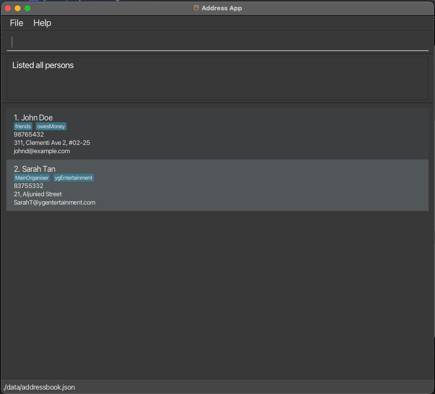
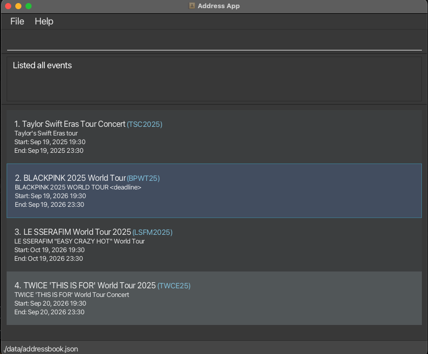
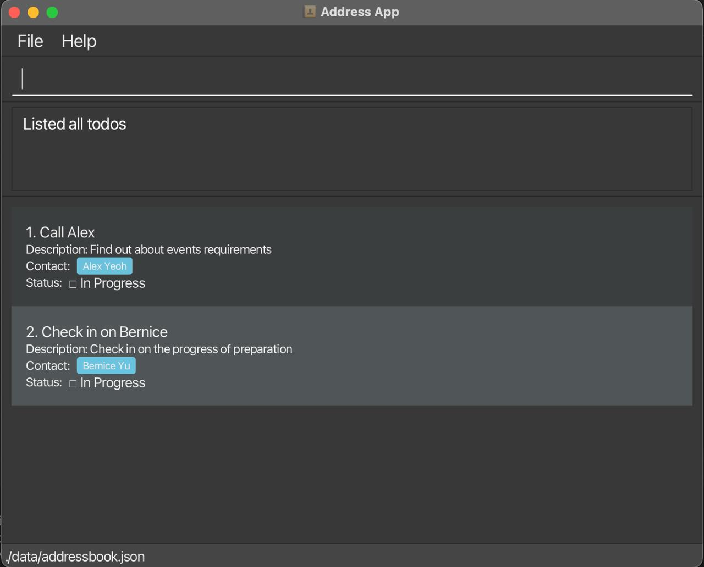

## Introduction

OverBooked is a desktop app for managing **contacts, events, and todos** — all from a single, efficient interface.

Designed for **event planners** who prefer **keyboard efficiency** over clicking through menus, OverBooked combines the **speed of a Command Line Interface (CLI)** with the **convenience of a modern GUI**.

### 📖 Table of Contents
- [Quick Start](#quick-start)
- [Features](#features)
    - [Contacts](#contacts)
    - [Events](#events)
    - [Todos](#todos)
- [FAQ](#faq)
- [Known Issues](#known-issues)
- [Command Summary](#command-summary)
---

## Quick start

Follow these steps to get started with Overbooked in under 2 minutes:

1. **Install Java `17`**
    - Verify with `java -version` in your own device's terminal
    - **Mac users:** Follow the [Java Installation Guide](https://se-education.org/guides/tutorials/javaInstallationMac.html).

2. **Download the App**
    - Grab the latest `.jar` file from our [Releases Page](https://github.com/AY2526S1-CS2103T-T10-2/tp/releases).

3. **Set up your workspace**
    - Move the `.jar` file into a folder of your choice — this will be your *OverBooked home folder*.

4. **Run the app**
    ```bash
    cd path/to/folder
   java -jar OverBooked.jar
    ```
   You should see a window like this:
   <br>
   

5. **Try these Commands**

   - `help` : Open the help window.
   - `list-contacts` : Lists all contacts.
   
   - `add-contact n/John Doe p/98765432 e/johnd@example.com a/John street, block 123, #01-01` : Adds a contact named `John Doe` to the Address Book.

   - `clear` : clears all Entries in the book

   - `exit` : Exits the app.


Refer to the [Features](#features) below for details of each command.

---

## Features

<div markdown="block" class="alert alert-info">

**:information_source: Notes about the command format:**<br>

- Words in `UPPER_CASE` are the parameters to be supplied by the user.<br>
  e.g. in `add-contact n/NAME`, `NAME` is a parameter which can be used as `add n/John Doe`.

- Items in square brackets are optional.<br>
  e.g `n/NAME [t/TAG]` can be used as `n/John Doe t/friend` or as `n/John Doe`.

- Items with <blank> means that an empty field (i.e. " ") can be used to define nothing for supported commands

- Items with `…`​ after them can be used multiple times including zero times.<br>
  e.g. `[t/TAG]…​` can be used as ` ` (i.e. 0 times), `t/friend`, `t/friend t/family` etc.

- Parameters can be in any order.<br>
  e.g. if the command specifies `n/NAME p/PHONE_NUMBER`, `p/PHONE_NUMBER n/NAME` is also acceptable.

- Extraneous parameters for commands that do not take in parameters (such as `help`, `list`, `exit` and `clear`) will be ignored.<br>
  e.g. if the command specifies `help 123`, it will be interpreted as `help`.

- If you are using a PDF version of this document, be careful when copying and pasting commands that span multiple lines as space characters surrounding line-breaks may be omitted when copied over to the application.
</div>

### Viewing help : `help`

Shows a message explaining how to access the help page.


Format: `help`

---

## 👤 Contacts


### Adding a person: `add-contact`

Adds a person to the address book.

Format: `add-contact n/NAME p/PHONE_NUMBER e/EMAIL a/ADDRESS [t/TAG]…​`

<div markdown="span" class="alert alert-primary">:bulb: **Tip:**
A person can have any number of tags (including 0)
</div>

Examples:

- `add-contact n/John Doe p/98765432 e/johnd@example.com a/John street, block 123, #01-01`
- `add-contact n/Betsy Crowe t/friend e/betsycrowe@example.com a/Newgate Prison p/1234567 t/criminal`

### Listing all persons : `list-contacts`

Shows a list of all persons in the address book.

Format: `list-contacts`

### Editing a person : `edit-contact`

Edits an existing person in the address book.

Format: `edit-contact INDEX [n/NAME] [p/PHONE] [e/EMAIL] [a/ADDRESS] [t/TAG]…​`

- Edits the person at the specified `INDEX`. The index refers to the index number shown in the displayed person list. The index **must be a positive integer** 1, 2, 3, …​
- At least one of the optional fields must be provided.
- Existing values will be updated to the input values.
- When editing tags, the existing tags of the person will be removed i.e adding of tags is not cumulative.
- You can remove all the person’s tags by typing `t/` without
  specifying any tags after it.

Examples:

- `edit-contact 1 p/91234567 e/johndoe@example.com` Edits the phone number and email address of the 1st person to be `91234567` and `johndoe@example.com` respectively.
- `edit-contact 2 n/Betsy Crower t/` Edits the name of the 2nd person to be `Betsy Crower` and clears all existing tags.

### Finding persons by name: `find-contact`

Finds persons whose names contain any of the given keywords.

Format: `find-contact n/KEYWORD [MORE_KEYWORDS]`

- The search is case-insensitive. e.g `hans` will match `Hans`
- The order of the keywords does not matter. e.g. `Hans Bo` will match `Bo Hans`
- Only the name is searched.
- Only full words will be matched e.g. `Han` will not match `Hans`
- Persons matching at least one keyword will be returned (i.e. `OR` search).
  e.g. `Hans Bo` will return `Hans Gruber`, `Bo Yang`

Examples:

- `find-contact n/John` returns `john` and `John Doe`
- `find-contact n/alex david` returns `Alex Yeoh`, `David Li`<br>
  

### Deleting a person : `delete-contact`

Deletes the specified person from the address book.

Format: `delete-contact INDEX`

- Deletes the person at the specified `INDEX`.
- The index refers to the index number shown in the displayed person list.
- The index **must be a positive integer** 1, 2, 3, …​

Examples:

- `list-contacts` followed by `delete-contact 2` deletes the 2nd person in the address book.
- `find-contact n/Betsy` followed by `delete-contact 1` deletes the 1st person in the results of the `find-contact` command.

--- 
## 🎫 Events



### Adding an event: `add-event`

Adds an event to the address book.

Format: `add-event en/EVENT_NAME ea/EVENT_ALIAS s/START_DATETIME e/END_DATETIME d/DESCRIPTION`

Examples:
- `add-event en/Taylor Swift Concert ea/TSC2025 s/2025-09-19 19:30 e/2025-09-19 23:30 d/Taylor's Swift Eras tour`

### Linking an event: `link-event`

Links a given contact (by index) to an event (by alias), creating an event tagged to that contact

Format: `link-event INDEX ea/EVENT_ALIAS`

Examples: 
- `link-event 1 ea/TSC2025`

### Listing all events : `list-events`

Shows a list of all events in the address book.

Format: `list-events`

### Editing an event: `edit-event`

Edits an existing event in the address book.

Format: `edit-event ea/EVENT_ALIAS [en/EVENT_NAME] [ea/EVENT_ALIAS] [s/START_DATETIME] [e/END_DATETIME] [d/DESCRIPTION]`

At least one of the optional fields must be provided.
Existing values will be updated to the input values.

Example:

- `edit-event ea/TSC2025 en/Taylor Swift’s Concert s/2025-09-19 18:30` Edits the event name and start datetime of the event with alias `TSC2025` to be `Taylor Swift’s Concert` and `2025-09-19 18:30` respectively.

### Finding events by alias: `find-event`

Find events whose aliases start with any of the given keywords.

Format: `find-event ea/KEYWORD [MORE_KEYWORDS]`

The search is case-insensitive. e.g `tsc` will match `TSC`
The order of the keywords does not matter.
Only the alias is searched.
Events matching at least one keyword will be returned (i.e. `OR` search). e.g. `tsc` will return `TSC2024`, `TSC2025`

Examples:

- `find-event ea/TSC` returns `TSC2024` and `TSC2025`
- `find-event ea/BTS BP` returns `BTS2025` and `BP2025`

### Deleting an event: `delete-event`

Deletes an event from the address book.

Format: `delete-event ea/EVENT_ALIAS`

Examples:
- `delete-event ea/TSC2025`

### Finding a contact by event: `find-by-event`

Finds and displays all contacts that are linked to a specific event.

Format: `find-by-event ea/EVENT_ALIAS`

Examples:
- `find-by-event ea/TSC2025`

---
## 📝 Todos



### Adding a todo: `add-todo`

Adds a todo to the address book.

Format: `add-todo tn/TODO_NAME td/TODO_DESCRIPTION n/NAME`

Examples:
- `add-todo tn/Call Alex td/Find out event requirements n/Alex Yeoh`

### Editing a todo: 'edit-todo'

Edits an existing todo in the address book.

Format: edit-todo INDEX [tn/TODO_NAME][td/TODO_DESCRIPTION][n/NAME]

Examples:
- `edit-todo tn/Call John n/John Doe`
- `edit-todo n/<blank>` unlinks the person from the todo task.

### Deleting a todo: `delete-todo`

Deletes a todo from the address book.

Format: `delete-todo INDEX`

Examples:
- `delete-todo 1`

### Listing all todos : `list-todos`

Shows a list of all todos in the address book.

Format: `list-todos`

### Marking a todo as completed : `mark-todo`

Marks the specified todo as completed.

Format: `mark-todo INDEX`

- Marks the todo at the specified `INDEX` as completed.
- The index refers to the index number shown in the displayed todo list.
- The index **must be a positive integer** 1, 2, 3, …​

Examples:

- `list-todos` followed by `mark-todo 2` marks the 2nd todo in the address book as completed.


### Marking a todo as incomplete : `unmark-todo`

Marks the specified todo as incomplete.

Format: `unmark-todo INDEX`

- Marks the todo at the specified `INDEX` as incomplete.
- The index refers to the index number shown in the displayed todo list.
- The index **must be a positive integer** 1, 2, 3, …​

Examples:

- `list-todos` followed by `unmark-todo 2` marks the 2nd todo in the address book as incomplete.

### Clearing all entries : `clear`

Clears all entries from the address book.

Format: `clear`

### Exiting the program : `exit`

Exits the program.

Format: `exit`

### Saving the data

AddressBook data are saved in the hard disk automatically after any command that changes the data. There is no need to save manually.

### Editing the data file

AddressBook data are saved automatically as a JSON file `[JAR file location]/data/addressbook.json`. Advanced users are welcome to update data directly by editing that data file.

<div markdown="span" class="alert alert-warning">:exclamation: **Caution:**
If your changes to the data file makes its format invalid, AddressBook will discard all data and start with an empty data file at the next run. Hence, it is recommended to take a backup of the file before editing it.<br>
Furthermore, certain edits can cause the AddressBook to behave in unexpected ways (e.g., if a value entered is outside of the acceptable range). Therefore, edit the data file only if you are confident that you can update it correctly.
</div>

---

## FAQ

**Q**: How do I transfer my data to another Computer?<br>
**A**: Install the app in the other computer and overwrite the empty data file it creates with the file that contains the data of your previous AddressBook home folder.

---

## Known issues

1. **When using multiple screens**, if you move the application to a secondary screen, and later switch to using only the primary screen, the GUI will open off-screen. The remedy is to delete the `preferences.json` file created by the application before running the application again.
2. **If you minimize the Help Window** and then run the `help` command (or use the `Help` menu, or the keyboard shortcut `F1`) again, the original Help Window will remain minimized, and no new Help Window will appear. The remedy is to manually restore the minimized Help Window.

---

## Command summary

| Action             | Format, Examples                                                                                                                                                                                 |
|--------------------|--------------------------------------------------------------------------------------------------------------------------------------------------------------------------------------------------|
| 👤 **Contacts**    |                                                                                                                                                                                                  |
| **add-contact**    | `add-contact n/NAME p/PHONE_NUMBER e/EMAIL a/ADDRESS [t/TAG]…​` <br> e.g., `add n/James Ho p/22224444 e/jamesho@example.com a/123, Clementi Rd, 1234665 t/friend t/colleague`                    |
| **edit-contact**   | `edit-contact INDEX [n/NAME] [p/PHONE] [e/EMAIL] [a/ADDRESS] [t/TAG]…​`<br>e.g. `edit-contact 2 n/James Lee e/jameslee@example.com`                                                              |
| **delete-contact** | `delete-contact INDEX`<br>e.g. `delete-contact 3`                                                                                                                                                |
| **find-contact**   | `find-contact n/KEYWORD [MORE_KEYWORDS]`<br>e.g. `find-contact n/James Jake`                                                                                                                     |                                                                                                                                                                |
| **list-contacts**  | `list-contacts`                                                                                                                                                                                  |
| **find-by-event**  | `find-by-event ea/EVENT_ALIAS`<br>e.g. `find-by-event ea/TSC2025`                                                                                                                                |
| 🎫 **Events**      |                                                                                                                                                                                                  |
| **add-event**      | `add-event en/EVENT_NAME ea/EVENT_ALIAS s/START_DATETIME e/END_DATETIME d/DESCRIPTION`<br>e.g. `add-event en/Taylor Swift Concert ea/TSC2025 s/2025-09-19 19:30 e/2025-09-19 23:30 d/World Tour` |
| **edit-event**     | `edit-event ea/EVENT_ALIAS [en/EVENT_NAME] [s/START] [e/END] [d/DESCRIPTION]`<br>e.g. `edit ea/TSC2025 en/Taylor Swift’s Concert s/2025-09-19 18:30`                                             |
| **delete-event**   | `delete-event ea/EVENT_ALIAS`<br>e.g. `delete-event ea/TSC2025`                                                                                                                                  |
| **list-events**    | `list-events`                                                                                                                                                                                    |
| **find-event**     | `find-event ea/KEYWORD [MORE_KEYWORDS]`<br>e.g. `find-event ea/TSC`                                                                                                                              |
| **link-event**     | `link-event INDEX ea/[EVENT_ALIAS]`<br>e.g. `link-event 1 ea/TSC2025`                                                                                                                            |
| **unlink-event**   | `unlink-event INDEX`<br>e.g. `unlink-event 1`                                                                                                                                                    |
| 📝 **Todos**       |                                                                                                                                                                                                  |
| **add-todo**       | `add-todo tn/TODO_NAME td/TODO_DESCRIPTION n/NAME`<br>e.g. `add-todo tn/Call Alex td/Confirm event n/Alex Yeoh`                                                                                  |
| **edit-todo**      | `edit-todo INDEX [tn/TODO_NAME] [td/TODO_DESCRIPTION] [n/NAME]` <br>e.g. `edit-todo tn/Call John td/Confirm appointment with John n/John Doe`                                                    |
| **delete-todo**    | `delete-todo INDEX` <br> e.g.`delete-todo 1`                                                                                                                                                     |
| **list-todos**     | `list-todos`                                                                                                                                                                                     |
| **mark-todo**      | `mark-todo INDEX`<br> e.g.`mark-todo 1`                                                                                                                                                          |
| **unmark-todo**    | `unmark-todo INDEX` <br> e.g.`unmark-todo 1`                                                                                                                                                     |
| 💻 **System**      |                                                                                                                                                                                                  |
| **help**           | `help`                                                                                                                                                                                           |
| **clear**          | `clear`                                                                                                                                                                                          |
| **exit**           | `exit`                                                                                                                                                                                           |                                                                                                                                                                                              |

