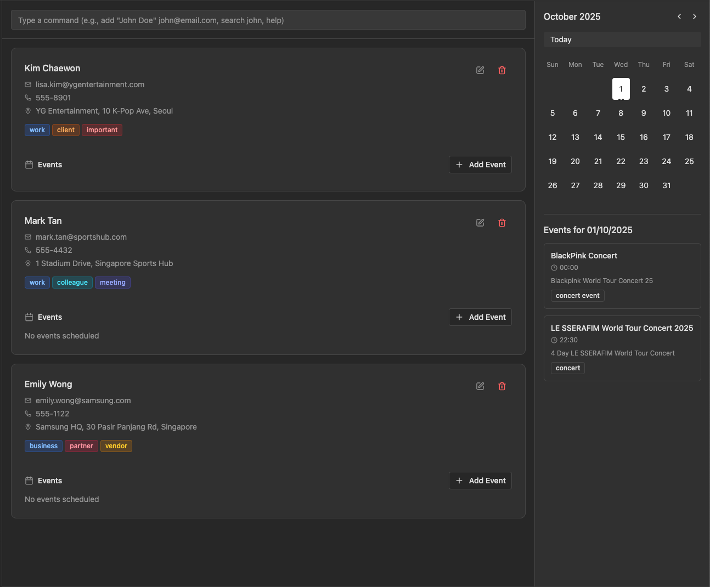

## Introduction

OverBooked is a desktop, keyboard-first planner that unifies contacts, events, and todos in one fast, modern interface. 

It solves slow, click-heavy planning by letting you type to act - add/find/update in seconds, filter instantly, and link people to events/todos while spotting schedule overlaps at a glance. The appeal: crisp speed, minimal friction, and a workflow built for event planners who want proficiency without fuss.

### 📖 Table of Contents

- [Quick Start](#quick-start)
- [Features](#features)
  - [Contacts](#contacts)
  - [Events](#events)
  - [Todos](#todos)
  - [Miscellaneous](#miscellaneous)
- [FAQ](#faq)
- [Known Issues](#known-issues)
- [Command Summary](#command-summary)

---

## Quick start

Follow these steps to get started with OverBooked in under 10 minutes:

1. **Install Java `17`**

     **For Windows users:**
   - Follow the [Java Installation Guide](https://se-education.org/guides/tutorials/javaInstallationWindows.html). 
   - To open **PowerShell** (**Windows** terminal), press the **Windows** key, type **PowerShell**, press **Enter**. 
   - To verify that the installation was successful, close **PowerShell**, open it again, then run `java -version`. You should see something like `java version "17.x.x"`.
   - If you have multiple versions of `Java` installed, refer to this [Switching between Java versions Guide](https://se-education.org/guides/tutorials/javaInstallationWindows.html#switching-between-java-versions).
   
    **For macOS users:** 
   - Follow the [Java Installation Guide](https://se-education.org/guides/tutorials/javaInstallationMac.html).
   - To open **Terminal** (macOS terminal), press **⌘ Space** (Spotlight), type **Terminal**, press **return**.
   - To verify that the installation was successful, close **Terminal**, open it again, then run `java -version`. You should see the version information for `Java 17.0.14.fx-zulu`.
   - If you have multiple versions of `Java` installed, refer to this [Switching between Java versions Guide](https://se-education.org/guides/tutorials/javaInstallationMac.html#switching-between-java-versions). (Commands are to be run inside **Terminal**)
2. **Download the App**

   - Find the latest version of **OverBooked** from our [Releases Page](https://github.com/AY2526S1-CS2103T-T10-2/tp/releases), and click on `OverBooked.jar` which should start the download automatically.
3. **Set up your workspace**

   - Go to your **Downloads** folder to verify that `OverBooked.jar` has been downloaded into your PC.
   - Drag and drop `OverBooked.jar` into a folder of your choice — this will be your _OverBooked home folder_. 

4. **Run the app**

    **For Windows users:**
   - Open the folder containing `OverBooked.jar`.
   - Double-click on `OverBooked.jar` to run the application. 
   
    **For macOS users:**
   - In the **Terminal** window, type `cd` and press the **return** key.
   - Go back to **Terminal** and type `cd` and press the **SpaceBar** key, do not press the **return** key yet. 
   - Open your **Finder** and locate the **folder** that contains `OverBooked.jar`.
   - Drag the **folder** that contains `OverBooked.jar` into the **Terminal**. This should paste some text into the **Terminal** window. Press the **return** key.
   - In the **Terminal** window, paste `java -jar OverBooked.jar` and press the **return** key.

  You should see a window like this:
   

5. **Try these Commands**

   - `help` : Open the help window.

   - `list-contacts` : Lists all contacts.

   - `add-contact n/John Doe p/98765432 e/johnd@example.com a/John street, block 123, #01-01` : Adds a contact named `John Doe` to the Address Book.

   - `clear` : clears all Entries in the book

   - `exit` : Exits the app.

Refer to the [Features](#features) below for details of each command.

---

## Features

### Introduction to Prefixes

| Prefix                  | Constraint(s)                                                                                                                                                                                       |
|-------------------------|-----------------------------------------------------------------------------------------------------------------------------------------------------------------------------------------------------|
| `n/` (Name)             | Alphanumeric characters, spaces and slashes(/) only. Cannot be blank or start with whitespace or a slash.                                                                                           |
| `p/` (Phone)            | Numbers only, at least 3 digits.                                                                                                                                                                    |
| `e/` (Email)            | Must follow format: local-part@domain. Local-part: Alphanumeric and `+`, `_`, `.`, `-` (not at start/end). Domain: period-separated labels starting/ending with alnum, last label at least 2 chars. |
| `a/` (Address)          | Any value; cannot be blank.                                                                                                                                                                         |
| `t/` (Tag)              | Alphanumeric only, minimum 1 character.                                                                                                                                                             |
| `en/` (Event Name)      | 1-50 chars; letters, numbers, spaces, apostrophes ('), hyphens (-), ampersands (&), commas (,); trimmed.                                                                                            |
| `ea/` (Event Alias)     | 1-20 chars; alphanumeric, hyphens (-), underscores (_); cannot be blank.                                                                                                                            |
| `st/`, `et/` (DateTime) | Format: `yyyy-MM-dd HH:mm` (e.g., `2025-09-19 19:30`). Must be valid date and time.                                                                                                                 |
| `d/` (Event Desc)       | 1-50 chars (including special characters like slashes); must be non-empty after trimming whitespace.                                                                                                |
| `tn/` (Todo Name)       | 1-50 chars; letters, numbers, spaces, apostrophes ('), hyphens (-), ampersands (&), commas (,), slashes (/); trimmed.                                                                               |
| `td/` (Todo Desc)       | 1-50 chars (including special characters like slashes); must be non-empty after trimming whitespace.                                                                                                |
| `INDEX`                 | Positive integer, non-zero (used for selecting list items).                                                                                                                                         |

**:information_source: Notes about the command format:** 

- All fields will be automatically trimmed (no spacing before or after each parameter) when input inside the command

- Words in `UPPER_CASE` are the parameters to be supplied by the user. 
  e.g. in `add-contact n/NAME`, `NAME` is a parameter which can be used as `add n/John Doe`.

- Items in square brackets are optional. 
  e.g `n/NAME [t/TAG]` can be used as `n/John Doe t/friend` or as `n/John Doe`.

- Items with `<blank>` means that an empty field (i.e. " ") can be used to define nothing for supported commands

- Items with `…`​ after them can be used multiple times including zero times. 
  e.g. `[t/TAG]…​` can be used as ` ` (i.e. 0 times), `t/friend`, `t/friend t/family` etc.

- Parameters can be in any order. 
  e.g. if the command specifies `n/NAME p/PHONE_NUMBER`, `p/PHONE_NUMBER n/NAME` is also acceptable.

- Extraneous parameters for the commands `help`, `exit` and `clear` will be ignored. 
  e.g. if the command specifies `help 123`, it will be interpreted as `help`.

- If you are using a PDF version of this document, be careful when copying and pasting commands that span multiple lines as space characters surrounding line-breaks may be omitted when copied over to the application.

### Viewing help : `help`

Shows a message explaining how to access the help page.

Format: `help`

---
## Contacts

❗Each person cannot have the same name (case-insensitive).

### Adding a person: `add-contact`

Adds a person to the address book. A person is uniquely identified only by their name in 
OverBooked; that is, that 2 contacts are considered different people as long as their names are 
different in a case-insensitive comparison. This also means that 2 different people can have the 
same phone number, address and email address.

The command will remove any filters currently in the contact list after execution.

Format: `add-contact n/NAME p/PHONE_NUMBER e/EMAIL a/ADDRESS [t/TAG]…​`

:bulb: **Tip:**
A person can have any number of tags (including 0)

Examples:

- `add-contact n/John Doe p/98765432 e/johnd@example.com a/John street, block 123, #01-01`
- `add-contact n/Betsy Crowe t/friend e/betsycrowe@example.com a/Newgate Prison p/1234567 t/criminal`

### Listing all persons : `list-contacts`

Shows a list of all persons in the address book. This removes any filters currently in the contact list.

Format: `list-contacts`

### Editing a person : `edit-contact`

Edits an existing person in the address book. This removes any filters currently in the contact list.

❗While editing a person, we would require at least one field!

Format: `edit-contact INDEX [n/NAME] [p/PHONE] [e/EMAIL] [a/ADDRESS] [t/TAG]…​`

- Edits the person at the specified `INDEX`.
- The index refers to the index number shown in the displayed person list.
- The index **must be a positive integer** 1, 2, 3, …​
- At least one of the optional fields must be provided.
- Existing values will be updated to the input values.
- When editing tags, the existing tags of the person will be removed i.e adding of tags is not cumulative.
- You can remove all the person’s tags by typing `t/` without
  specifying any tags after it.

Examples:

- `edit-contact 1 p/91234567 e/johndoe@example.com` Edits the phone number and email address of the 1st person to be `91234567` and `johndoe@example.com` respectively.
- `edit-contact 2 n/Betsy Crower t/` Edits the name of the 2nd person to be `Betsy Crower` and clears all existing tags.

### Finding persons by name: `find-contacts`

Finds persons whose names contain any of the given keywords.

Format: `find-contacts n/KEYWORD [MORE_KEYWORDS]`

- The search is case-insensitive. e.g `hans` will match `Hans`
- The order of the keywords does not matter. e.g. `Hans Bo` will match `Bo Hans`
- Only the name is searched.
- Only full words will be matched e.g. `Han` will not match `Hans`
- Persons matching at least one keyword will be returned (i.e. `OR` search).
  e.g. `Hans Bo` will return `Hans Gruber`, `Bo Yang`

:bulb: **Tip:**
list-contacts can be used to remove the filter. add-contact and edit-contact will also remove the filter after its execution.

Examples:

- `find-contacts n/John` returns `john` and `John Doe`
- `find-contacts n/alex david` returns `Alex Yeoh`, `David Li` 

### Deleting a person : `delete-contact`

Deletes the specified person from the address book.

Format: `delete-contact INDEX`

- Deletes the person at the specified `INDEX`.
- The index refers to the index number shown in the displayed person list.
- The index **must be a positive integer** 1, 2, 3, …​

Examples:

- `list-contacts` followed by `delete-contact 2` deletes the 2nd person in the address book.
- `find-contacts n/Betsy` followed by `delete-contact 1` deletes the 1st person in the results of the `find-contact` command.

---

## Events

### Adding an event: `add-event`

Adds an event to the address book. This removes any filters currently in the event list.

❗The event alias is enforced to be unique, meaning you can't repeat existing event alises (case-insensitive)

Format: `add-event en/EVENT_NAME ea/EVENT_ALIAS st/START_DATETIME et/END_DATETIME d/DESCRIPTION`

Examples:

- `add-event en/Taylor Swift Concert ea/TSC2025 st/2025-09-19 19:30 et/2025-09-19 23:30 d/Taylor's Swift Eras tour`

### Linking an event: `link-event`

Links a given contact (by index based on displayed list) to an event (by alias)

❗Each contact can only link to **one** specific event  

❗Linking an event to a contact that already has an event linked, will just update and replace it

Format: `link-event INDEX [MORE_INDEXES] ea/EVENT_ALIAS`

- The index refers to the index number shown in the displayed person list.
- The index **must be a positive integer** 1, 2, 3, …​

Examples:

- `link-event 1 ea/TSC2025`
- `link-event 1 2 ea/OL2028`

### Unlinking an event: `unlink-event`

Unlink any given contact (by index based on displayed list) from an event

Format: `unlink-event INDEX [MORE_INDEXES]`

- The index refers to the index number shown in the displayed person list.
- The index **must be a positive integer** 1, 2, 3, …​

Examples:

- `unlink-event 1 2`

### Listing all events : `list-events`

Shows a list of **all** events in the address book. This removes any filters currently in the event list.

Format: `list-events`

### Editing an event: `edit-event`

Edits an existing event in the address book. This removes any filters currently in the event list.

❗While editing an event, we would require at least one field!

:bulb: **Tip:**
an EventAlias cannot be edited in order to enforce uniqueness
The event alias field included in the field is to identify which specific event you want to amend.

Format: `edit-event ea/EVENT_ALIAS [en/EVENT_NAME] [st/START_DATETIME] [et/END_DATETIME] [d/DESCRIPTION]`

At least one of the optional fields must be provided.
Existing values will be updated to the input values.

Example:

- `edit-event ea/TSC2025 en/Taylor Swift’s Concert st/2025-09-19 18:30` Edits the event name and start datetime of the event with alias `TSC2025` to be `Taylor Swift’s Concert` and `2025-09-19 18:30` respectively.

### Finding events by alias: `find-event`

Find events whose aliases start with any of the given keywords.

Format: `find-event ea/KEYWORD [MORE_KEYWORDS]`

The search is case-insensitive. e.g `tsc` will match `TSC`
The order of the keywords does not matter.
Only the alias is searched.
Events whose aliases start with at least one keyword will be returned (i.e. `OR` search). e.g. `tsc` will return 
`TSC2024`, `TSC2025`. In short, the search does not require the full alias to match the searched 
prefix.

:bulb: **Tip:**
list-events can be used to remove the filter. add-event and edit-event will also remove the filter after its execution.

Examples:

- `find-event ea/TSC` returns `TSC2024` and `TSC2025`
- `find-event ea/BTS BP` returns `BTS2025` and `BP2025`

### Deleting an event: `delete-event`

Deletes an event from the address book.

Format: `delete-event ea/EVENT_ALIAS`

Examples:

- `delete-event ea/TSC2025`

### Finding a contact by event: `find-by-event`

Finds and displays all contacts that are linked to a specific event.

Format: `find-by-event ea/EVENT_ALIAS`

:bulb: **Tip:**
list-contacts can be used to remove the filter. add-contact and edit-contact will also remove the filter after its execution.

Examples:

- `find-by-event ea/TSC2025`

---

## Todos

❗Each Todo cannot have the same todoname and description (both case-insensitive)

### Adding a todo: `add-todo`

Adds a todo to the address book.

Format: `add-todo tn/TODO_NAME td/TODO_DESCRIPTION [n/NAME]`

- Only existing contacts can be linked to a todo (i.e. an existing contact must have the specified contact name).

Examples:

- `add-todo tn/Call Alex td/Find out event requirements n/Alex Yeoh`

### Editing a todo: `edit-todo`

Edits an existing todo in the address book.

❗While editing a todo, we would require at least one field!

Format: `edit-todo INDEX [tn/TODO_NAME] [td/TODO_DESCRIPTION] [n/NAME]`

- Edits the todo at the specified `INDEX`.
- The index refers to the index number shown in the displayed todo list.
- The index **must be a positive integer** 1, 2, 3, …​
- Only existing contacts can be linked to a todo (i.e. an existing contact must have the specified contact name).

Examples:

- `edit-todo 1 tn/Call John n/John Doe`
- `edit-todo 1 n/<blank>` unlinks the person from the first todo task.

### Deleting a todo: `delete-todo`

Deletes a todo from the address book.

Format: `delete-todo INDEX`

- Deletes the todo at the specified `INDEX`.
- The index refers to the index number shown in the displayed todo list.
- The index **must be a positive integer** 1, 2, 3, …​

Examples:

- `delete-todo 1`

### Listing all todos : `list-todos`

Shows a list of all todos in the address book.

Format: `list-todos`

### Marking a todo as completed : `mark-todo`

Marks the specified todo as completed.

Format: `mark-todo INDEX`

- Marks the todo at the specified `INDEX` as completed.
- The index refers to the index number shown in the displayed todo list.
- The index **must be a positive integer** 1, 2, 3, …​

Examples:

- `list-todos` followed by `mark-todo 2` marks the 2nd todo in the address book as completed.

### Marking a todo as incomplete : `unmark-todo`

Marks the specified todo as incomplete.

Format: `unmark-todo INDEX`

- Marks the todo at the specified `INDEX` as incomplete.
- The index refers to the index number shown in the displayed todo list.
- The index **must be a positive integer** 1, 2, 3, …​

Examples:

- `list-todos` followed by `unmark-todo 2` marks the 2nd todo in the address book as incomplete.

---

## Miscellaneous

### Clearing all entries : `clear`

Clears all entries from the address book.

Format: `clear`

### Exiting the program : `exit`

Exits the program.

Format: `exit`

### Saving the data

OverBooked data are saved in the hard disk automatically after any command that changes the data. There is no need to save manually.

### Editing the data file

OverBooked data are saved automatically as a JSON file `[JAR file location]/data/addressbook.json`. Advanced users are welcome to update data directly by editing that data file.

:exclamation: **Caution:**
If the data file becomes an invalid json or fields no longer fall within given restrictions after user edits, OverBooked will create a new empty file to replace it. Hence, it is recommended to make a backup of the file before editing it. 
Furthermore, certain edits can cause the OverBooked to behave in unexpected ways (e.g., if a value entered is outside of the acceptable range). Therefore, edit the data file only if you are confident that you can update it correctly.

---

## FAQ

**Q**: How do I transfer my data to another Computer? 
**A**: Install the app in the other computer and overwrite the empty data file it creates with the file that contains the data of your previous OverBooked
home folder.

---

## Known issues

1. **When using multiple screens**, if you move the application to a secondary screen, and later switch to using only the primary screen, the GUI will open off-screen. The remedy is to delete the `preferences.json` file created by the application before running the application again.
2. **If you minimize the Help Window** and then run the `help` command (or use the `Help` menu, or the keyboard shortcut `F1`) again, the original Help Window will remain minimized, and no new Help Window will appear. The remedy is to manually restore the minimized Help Window.

---

## Command summary

| Action             | Format, Examples                                                                                                                                                                                     |
|--------------------|------------------------------------------------------------------------------------------------------------------------------------------------------------------------------------------------------|
| 👤 **Contacts**    |                                                                                                                                                                                                      |
| **add-contact**    | `add-contact n/NAME p/PHONE_NUMBER e/EMAIL a/ADDRESS [t/TAG]…​`   e.g., `add-contact n/James Ho p/22224444 e/jamesho@example.com a/123, Clementi Rd, 1234665 t/friend t/colleague`                |
| **edit-contact**   | `edit-contact INDEX [n/NAME] [p/PHONE] [e/EMAIL] [a/ADDRESS] [t/TAG]…​` e.g. `edit-contact 2 n/James Lee e/jameslee@example.com`                                                                  |
| **delete-contact** | `delete-contact INDEX` e.g. `delete-contact 3`                                                                                                                                                    |
| **find-contacts**  | `find-contacts n/KEYWORD [MORE_KEYWORDS]` e.g. `find-contacts n/James Jake`                                                                                                                       |     |
| **list-contacts**  | `list-contacts`                                                                                                                                                                                      |
| **find-by-event**  | `find-by-event ea/EVENT_ALIAS` e.g. `find-by-event ea/TSC2025`                                                                                                                                    |
| 🎫 **Events**      |                                                                                                                                                                                                      |
| **add-event**      | `add-event en/EVENT_NAME ea/EVENT_ALIAS st/START_DATETIME et/END_DATETIME d/DESCRIPTION` e.g. `add-event en/Taylor Swift Concert ea/TSC2025 st/2025-09-19 19:30 et/2025-09-19 23:30 d/World Tour` |
| **edit-event**     | `edit-event ea/EVENT_ALIAS [en/EVENT_NAME] [st/START] [et/END] [d/DESCRIPTION]` e.g. `edit-event ea/TSC2025 en/Taylor Swift’s Concert st/2025-09-19 18:30`                                        |
| **delete-event**   | `delete-event ea/EVENT_ALIAS` e.g. `delete-event ea/TSC2025`                                                                                                                                      |
| **list-events**    | `list-events`                                                                                                                                                                                        |
| **find-event**     | `find-event ea/KEYWORD [MORE_KEYWORDS]` e.g. `find-event ea/TSC`                                                                                                                                  |
| **link-event**     | `link-event INDEX [MORE_INDEXES] ea/EVENT_ALIAS` e.g. `link-event 1 2 ea/TSC2025`                                                                                                                 |
| **unlink-event**   | `unlink-event INDEX [MORE_INDEXES]` e.g. `unlink-event 1 2`                                                                                                                                       |
| 📝 **Todos**       |                                                                                                                                                                                                      |
| **add-todo**       | `add-todo tn/TODO_NAME td/TODO_DESCRIPTION [n/NAME]` e.g. `add-todo tn/Call Alex td/Confirm event n/Alex Yeoh`                                                                                    |
| **edit-todo**      | `edit-todo INDEX [tn/TODO_NAME] [td/TODO_DESCRIPTION] [n/NAME]`  e.g. `edit-todo tn/Call John td/Confirm appointment with John n/John Doe`                                                        |
| **delete-todo**    | `delete-todo INDEX`   e.g.`delete-todo 1`                                                                                                                                                         |
| **list-todos**     | `list-todos`                                                                                                                                                                                         |
| **mark-todo**      | `mark-todo INDEX`  e.g.`mark-todo 1`                                                                                                                                                              |
| **unmark-todo**    | `unmark-todo INDEX`   e.g.`unmark-todo 1`                                                                                                                                                         |
| 💻 **System**      |                                                                                                                                                                                                      |
| **help**           | `help`                                                                                                                                                                                               |
| **clear**          | `clear`                                                                                                                                                                                              |
| **exit**           | `exit`                                                                                                                                                                                               |     |

**Notes:**

- Multiple entries permitted for tags (`[t/TAG]…​`).
- Optional prefixes can be left blank only where allowed (e.g., `n/<blank>` for unlinking a name from a todo).
- For all string fields, leading/trailing whitespace is trimmed.
- Date/time values must strictly follow the indicated format.
